# Sunum Planı: Diffusion Modellerine Giriş ve PyTorch Temelleri

**Tasarım Notu:** Sunum genelinde sade, minimalist ve modern bir tasarım dili benimsenecektir. Renk paleti ağırlıklı olarak siyah, beyaz ve gri tonlarından (monokrom) oluşacaktır. Gereksiz görsel kalabalığından kaçınılmalı, şık ve profesyonel bir duruş sergilenmelidir.

Bu belge, Diffusion Modelleri eğitimi ve önkoşullarını (PyTorch, Deep Learning) kapsayan sunumun detaylı planını içerir.


**Sunum Stratejisi:**
*   **Görsel Odaklı:** Konseptleri açıklamak için diyagramlar, metaforlar ve örnek görseller kullanılacak.
*   **Minimum Metin:** Slaytlarda sadece başlıklar ve çok kısa anahtar kelimeler olacak. Açıklamalar sözlü yapılacak.
*   **No Code:** Kod blokları yerine mantıksal akış şemaları kullanılacak.

---

## Bölüm 0: Giriş

### Slide 1: Kapak
*   **Başlık:** Deep Learning & Diffusion Models: Bir Yolculuk
*   **Alt Başlık:** PyTorch Temellerinden Üretken Yapay Zekaya
*   **Görsel:** Arka planı tamamen kaplayan, üzerine yazı gelebilecek şekilde tasarlanmış şık ve atmosferik bir görsel. Sol tarafta hafifçe beliren nöral ağ düğümleri, sağ tarafta ise sanatsal bir şekilde dağılan dijital partiküller (Diffusion efekti).
*   **Görsel Promptu:** "Atmospheric and minimalist presentation background, 16:9 aspect ratio, monochrome aesthetic (shades of black, white, and gray). Far left: faint, elegant neural network nodes softly emerging. Far right: artistic digital particles dispersing in a fluid diffusion effect. Spacious center area for text overlay. Sophisticated, clean, professional digital art, high resolution."
*   **Konuşmacı Notu:** Herkese merhaba. Bugün, modern yapay zekanın en heyecan verici alanlarından birine, "Üretken Yapay Zeka" dünyasına bir yolculuğa çıkacağız. Bu yolculukta sadece sonuçları değil, bu "sihrin" arkasındaki matematiği ve mantığı da keşfedeceğiz. Derin öğrenmenin yapı taşlarından başlayıp, metinden görüntü üreten Diffusion modellerinin çalışma prensiplerine kadar uzanan kapsamlı bir rotamız var. Amacımız, karmaşık denklemleri değil, bu sistemlerin "nasıl düşündüğünü" anlamak. Hazırsanız, PyTorch temelleriyle başlayalım.

### Slide 2: İçindekiler (Yol Haritası)
*   **Başlık:** Yol Haritası
*   **Görsel:** 3 duraklı modern bir yol haritası veya zaman çizelgesi.
    1.  **Hazırlık:** PyTorch ve Derin Öğrenme Temelleri.
    2.  **Keşif:** Diffusion Modelleri Nedir? (Unit 1).
    3.  **Hakimiyet:** Kontrol ve İnce Ayar (Unit 2).
*   **Konuşmacı Notu:** Sunumumuz üç ana istasyondan oluşuyor. İlk durağımız "Hazırlık". Burada çantamızı dolduracağız; sinir ağlarının temel çalışma prensiplerini, öğrenme mekanizmalarını ve bu işin dili olan PyTorch'u hatırlayacağız. İkinci durağımız "Keşif". Burada gürültüden anlam çıkarma sanatı olan Diffusion modellerinin (Unit 1) kalbine ineceğiz. Son durağımız ise "Hakimiyet". Modelin ne üreteceğini nasıl kontrol edeceğimizi ve onları kendi özel verilerimizle nasıl eğiteceğimizi (Unit 2) göreceğiz. Yolculuğun sonunda, bu modelleri kendi projelerinizde kullanabilecek vizyona sahip olacaksınız.

---

## Bölüm 1: Hazırlık (PyTorch & Deep Learning Prerequisities)
*Amaç: Seyirciyi temel kavramlarla ısındırmak ve Diffusion modellerine giden yolu döşemek.*

### Slide 3: Temel Kavramlar: Perceptron ve Sınırlar
*   **Başlık:** Karar Sınırları: Perceptron
*   **Görsel:** Basit bir 2D grafik. Kırmızı ve Mavi noktalar serpiştirilmiş. Aralarından geçen düz bir çizgi (Linear Boundary) onları ayırıyor. Köşede basit bir nöron şeması.
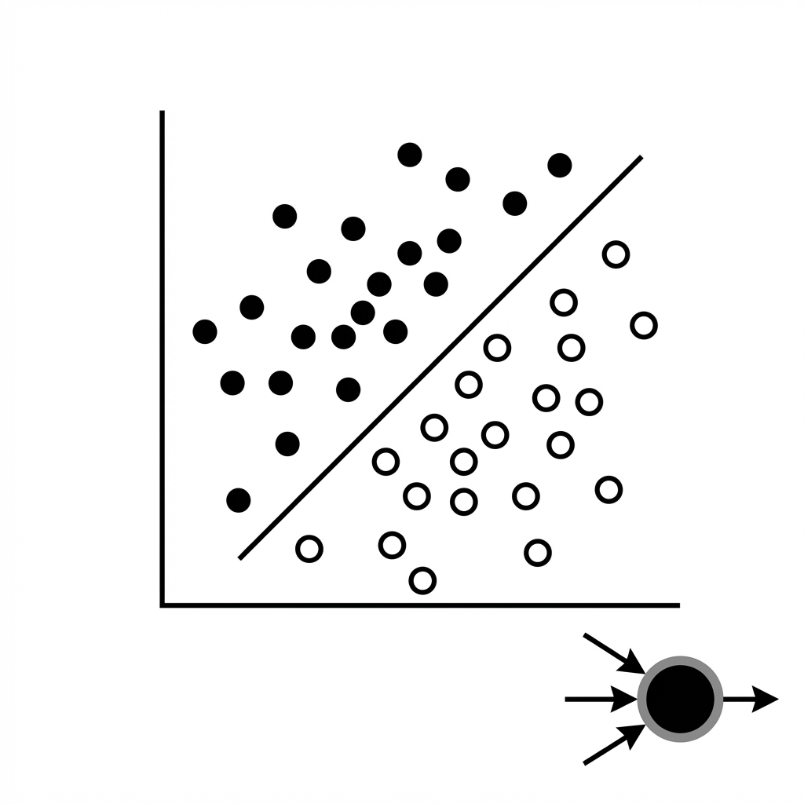
*   **Konuşmacı Notu:** Yapay zekanın atomuyla, yani "Perceptron" ile başlayalım. Bir sinir ağı aslında temelde bir sınıflandırma makinesidir. Elimizde kedi ve köpek verileri olduğunu düşünün (kırmızı ve mavi noktalar). Perceptron'un tek yaptığı, bu iki grubun arasına düz bir çizgi çekmektir. "Çizginin sağı kedi, solu köpek" diyebilmektir. Bu basit karar mekanizması, bugün göreceğimiz devasa modellerin temel yapı taşıdır. Ancak hayat her zaman düz bir çizgiyle ayrılabilecek kadar basit değildir, birazdan bunu nasıl aştığımızı göreceğiz.

### Slide 4: Karar Mekanizması: Softmax ve Cross Entropy
*   **Başlık:** Olasılık ve Hata: Softmax & Cross Entropy
*   **Görsel:** İki ikonlu bir akış.
    1.  Bir sayı listesini alan ve onları %'lik çubuklara dönüştüren bir huni (Softmax).
    2.  Modelin tahmini (Büyük çubuk) ile Gerçek Cevap arasıdaki mesafeyi ölçen bir cetvel (Cross Entropy).
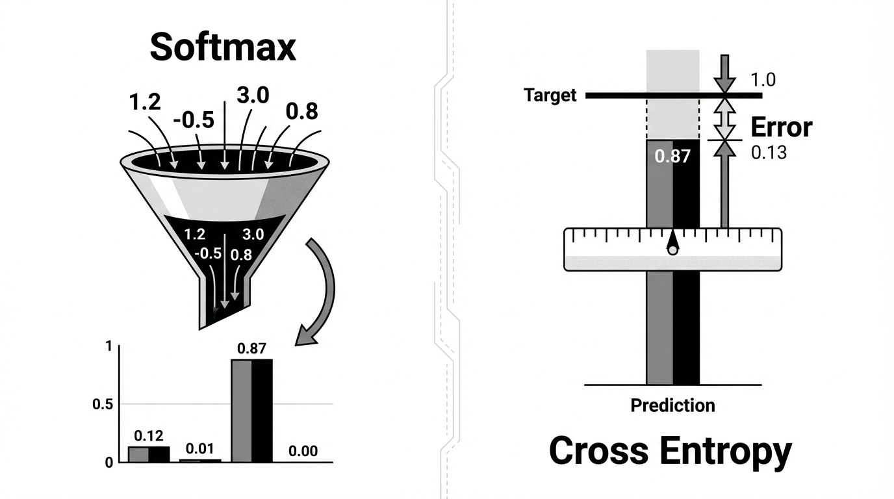
*   **Konuşmacı Notu:** Peki model kararlarını nasıl ifade eder? Bilgisayarlar aslında "Evet" veya "Hayır" demez, olasılık hesaplar. Modelin ürettiği ham puanları alıp, toplamı %100 olan anlaşılır olasılıklara (Örn: %90 Kedi, %10 Köpek) çeviren fonksiyona **Softmax** diyoruz. Peki model yanlış bilirse? İşte orada **Cross Entropy** devreye girer. Bu bizim "Hata Ölçeğimizdir". Modelin tahmini ile gerçek arasındaki mesafeyi ölçer. Hedefimiz, bu mesafeyi, yani hatayı sıfıra indirmektir.

### Slide 5: Öğrenmenin Motoru: Gradient Descent
*   **Başlık:** Hatadan Ders Çıkarmak: Gradient Descent
*   **Görsel:** "Gradient Descent" metaforu. Bir dağın tepesinden (Yüksek Hata) vadiye (Minimum Hata) inmeye çalışan bir top.
*   **Referans Görsel:** 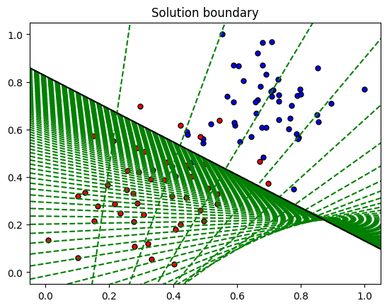
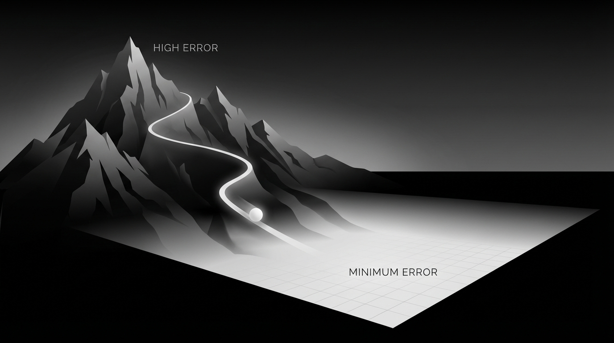
*   **Konuşmacı Notu:** Amacımız hatayı sıfıra indirmek. Bunu karanlıkta bir dağdan inmeye benzetebilirsiniz. Gradient Descent, eğime bakarak "Aşağısı bu tarafta" diyen pusulamızdır.in vadiye (Minimum Hata) inmeye çalışmak gibi düşünün. Önümüzü göremiyoruz, sadece ayağımızın altındaki eğimi hissedebiliyoruz. İşte **Gradient Descent** (Gradyan İnişi), her adımda eğime bakıp "Aşağısı şu tarafta" diyerek bizi vadiye yönlendiren pusulamızdır. Sinir ağlarının öğrenme dediği şey aslında tam olarak bu: Hatayı azaltacak yönde minik adımlar atmak.

### Slide 6: Büyük Resim: İleri ve Geri Yayılım
*   **Başlık:** Mimari: Feedforward & Backpropagation
*   **Görsel:** Basit bir ok döngüsü şeması.
    *   **İleri (Sağa ok):** Veri girer, tahmin çıkar.
    *   **Geri (Sola ok):** Hata hesaplanır, güncelleme geri döner.
*   **Referans Görsel:** 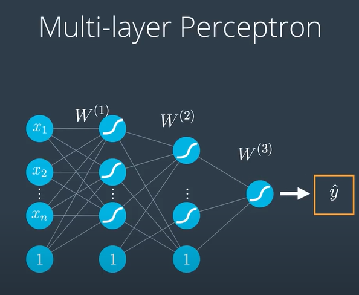
*   **Konuşmacı Notu:** Sinir ağları bir döngüde çalışır. İleriye doğru giderek tahmin yapar (Feedforward). Hatayı görünce, geriye dönüp "Senin yüzünden hata yaptık" diyerek nöronları günceller (Backpropagation).de bulunur; buna **Feedforward** (İleri Besleme) diyoruz. Sonra sonuca bakar, hatasını görür ve geriye dönüp "Senin yüzünden hata yaptık" diyerek suçlu nöronların ayarlarını (ağırlıklarını) değiştirir. Buna da **Backpropagation** (Geri Yayılım) diyoruz. Model bu döngüyü milyonlarca kez tekrarlayarak mükemmelleşir.

### Slide 7: Sorun 1: Ezberlemek (Overfitting)
*   **Başlık:** Ezber mi, Öğrenme mi? (Overfitting)
*   **Görsel:** İki grafik yan yana.
    *   Sol: Veri noktalarının üzerinden tek tek geçen, çok kıvrımlı, aşırı karmaşık bir çizgi (Overfitting).
    *   Sağ: Veri noktalarının ortasından geçen pürüzsüz, genel bir çizgi (Good Fit).
*   **Referans Görsel:** 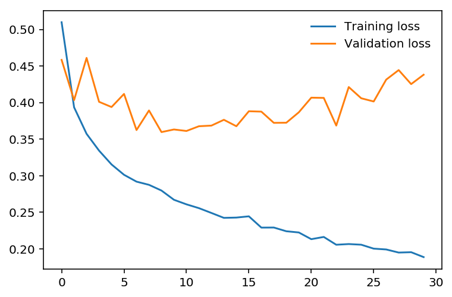
*   **Konuşmacı Notu:** En büyük düşmanımız: Ezberlemek. Model eğitim verisine o kadar kafayı takar ki (Overfitting), genel kuralı görmeyi reddeder. Sınav sorularını ezberleyen ama konuyu bilmeyen öğrenci gibidir.ş sınav sorularının cevaplarını ezberlediğini düşünün. Sınavda 100 alır ama hayatta başarısız olur. Modelimiz de eğitim verisine aşırı odaklanıp, her bir noktayı ezberlemeye çalışırsa (soldaki grafik), yeni ve görmediği verilerle karşılaştığında çuvallar. Bizim istediğimiz, ezberlemek değil, alttaki genel kuralı, yani "deseni" öğrenmektir (sağdaki grafik).

### Slide 8: Çözüm: Sadeliğin Gücü (Regularization)
*   **Başlık:** Sadeliğin Gücü: Regularization (L1 & L2)
*   **Görsel:** Heykel Metaforu. Sol tarafta karmaşık, dikenli, göz yoran bir yapı (Overfitting - Karmaşa). Sağ tarafta ise fazlalıkları yontulmuş, pürüzsüz ve estetik, "özü" kalmış bir küre veya heykel (Regularized - Sadelik).
*   **Görsel Promptu:** "Minimalist conceptual art, 16:9. A visual metaphor for simplification. Left side shows a jagged, chaotic, complex shape with too much noise. Right side shows the same shape transformed into a smooth, clean, polished geometric form. The transition represents regularization. Monochrome, high contrast, artistic style."
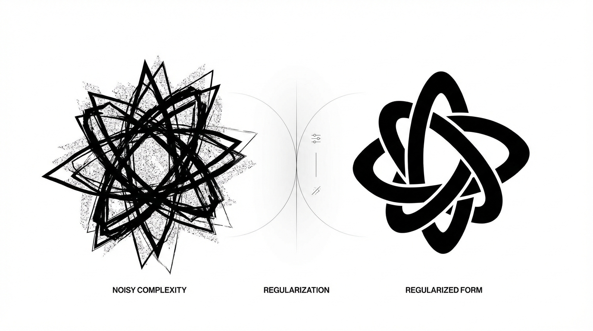
*   **Konuşmacı Notu:** Ezberci bir modeli nasıl yola getiririz? Onu "sadeleşmeye" zorlayarak. Bir model veriyi ezberlemek için "aşırı efor" sarf eder (çok büyük sayılar kullanır). **Regularization**, modele "Çözümü bul ama enerjini ekonomik kullan" diyen bir kısıtlamadır. Modeli, karmaşık yollara saptığında cezalandırırız. Bu sayede model, verideki gürültülü detayları (o dikenleri) bırakıp, sadece ana yapıyı (o pürüzsüz heykeli) öğrenmek zorunda kalır. Unutmayın: Bilimde en iyi açıklama, genellikle en basit olandır (Ockham'ın Usturası).

### Slide 9: Çözüm: Unutma Sanatı (Dropout)
*   **Başlık:** Rastgele Unutma: Dropout
*   **Görsel:** Bir sinir ağı şeması, ancak bazı nöronlar sönük (gri/kapalı). Aktif nöronlar değişiyor gibi bir his (veya statik olsa da bazıları off).
*   **Görsel Promptu:** "Minimalist neural network visualization, 16:9. A structured grid of circular nodes connected by lines. Some random nodes and connections are **faded out** or missing (representing dropout), while others are bold and active. Monochrome aesthetic (shades of gray and black). Technical, clean, schematic style."
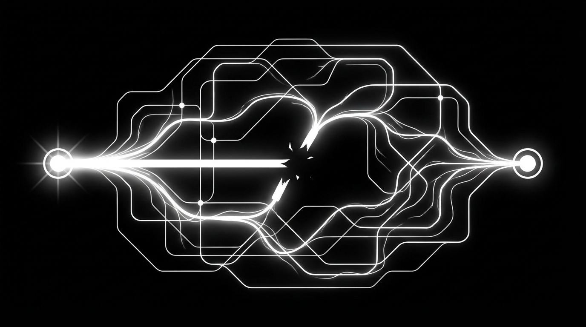
*   **Konuşmacı Notu:** Ezberlemeyi önlemenin bir diğer dâhiyane yolu da **Dropout**'tur. Eğitim sırasında rastgele bazı nöronları kapatırız. Bu, modeli "tek bir nörona veya bilgi yoluna güvenemezsin, her an gidebilir" demeye zorlar. Tıpkı bir spor takımında yıldız oyuncu sakatlandığında diğerlerinin sorumluluk alması gibi, model de bilgiyi genele yaymayı ve daha sağlam (robust) bir yapı kurmayı öğrenir.

### Slide 10: Sorun 2: Kaybolan Sinyaller ve ReLU
*   **Başlık:** Sinyali Canlı Tutmak: ReLU & Vanishing Gradient
*   **Görsel:** Bir boru hattı.
    *   Eski Boru (Sigmoid): Su (Sinyal) gittikçe azalıp damlaya dönüşüyor.
    *   Yeni Boru (ReLU): Su gürül gürül akmaya devam ediyor.
*   **Referans Görsel:** 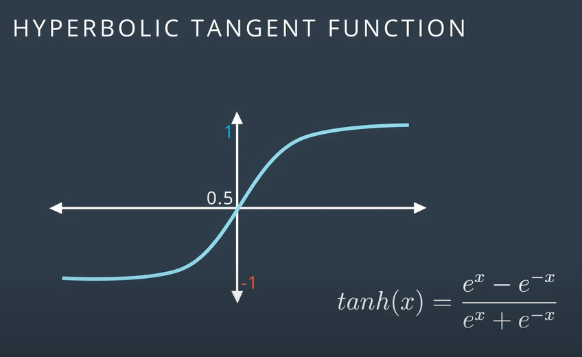 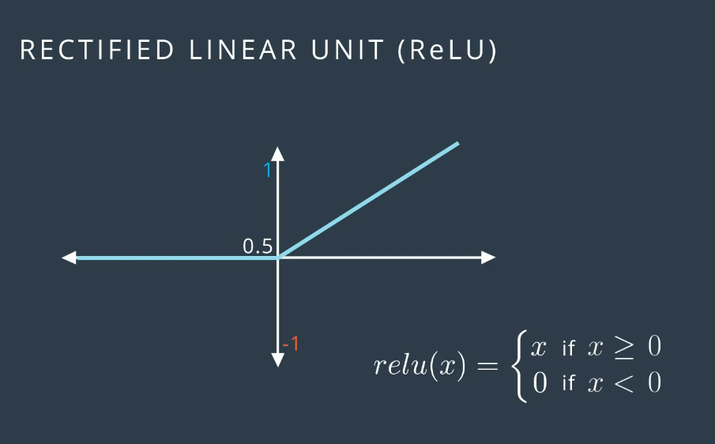
*   **Konuşmacı Notu:** Derin ağlarda bilgi iletilirken kaybolabilir (Vanishing Gradient). Bunu çözmek için **ReLU** aktivasyonunu kullanıyoruz. Negatifleri atar, pozitifleri olduğu gibi geçirir; böylece sinyal sönümlenmez.t**). Bu, modelin öğrenmesinin durması demektir. Eskiden kullanılan Sigmoid gibi fonksiyonlar sinyali çok sıkıştırıyordu. Günümüzün kahramanı **ReLU** (Rectified Linear Unit) ise çok basit bir mantıkla çalışır: "Negatifse at, pozitifse olduğu gibi geçir." Bu basitlik, sinyalin derin ağlarda bile güçlü kalmasını ve çok daha hızlı, etkili öğrenmeyi sağlar.

### Slide 11: Yöntem: Parça Parça Öğrenmek (Batch vs SGD)
*   **Başlık:** Adım Adım İlerlemek: Batch vs SGD
*   **Görsel:** Bir pasta yeme metaforu.
    *   Tüm pastayı tek lokmada yemeye çalışmak (Batch - Zor, tıkalı).
    *   Küçük dilimler halinde yemek (Stochastic/Mini-batch - Hızlı, akıcı).
*   **Görsel Promptu:** "Minimalist infographic art, 16:9 aspect ratio. A visual comparison of two eating styles. Left side: A giant, overwhelming single block of food (representing Batch Processing), with a small fork trying to lift it, looking difficult and slow. Right side: The same amount of food cut into many small, manageable, bite-sized cubes (representing Stochastic/Mini-batch), being eaten quickly and rhythmically. Clean lines, monochrome aesthetic (shades of black, white, and gray). Conceptual, flat design, high contrast."
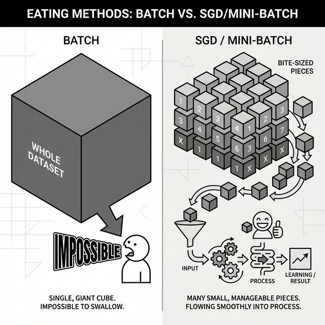
*   **Konuşmacı Notu:** Milyonlarca veriyi aynı anda işleyip tek bir adım atmak (Batch Gradient Descent) bilgisayarlar için çok yorucudur ve yavaştır. Bunun yerine veriyi küçük paketlere (Batch) böleriz. Her pakette bir adım atarız. Buna **Stochastic Gradient Descent (SGD)** denir. Slayttaki pasta örneği gibi; koca pastayı tek lokmada yutmaya çalışmak yerine, küçük dilimler halinde yemek hem daha hızlıdır hem de sindirmesi (işlemesi) daha kolaydır. Ayrıca bu yöntem, modelin takılıp kalmasını da engeller.

### Slide 12: Hız Ayarı: Learning Rate & Momentum
*   **Başlık:** Hız Kontrolü: Learning Rate & Momentum
*   **Görsel:** Bir çukura girmeye çalışan golf topu.
    *   Çok hızlı vuruş (Learning Rate yüksek) -> Top delikten seker.
    *   Çok yavaş vuruş (Learning Rate düşük) -> Top deliğe varamaz.
    *   Momentum çizgisi -> Hızlanıp engelleri aşan bir top.
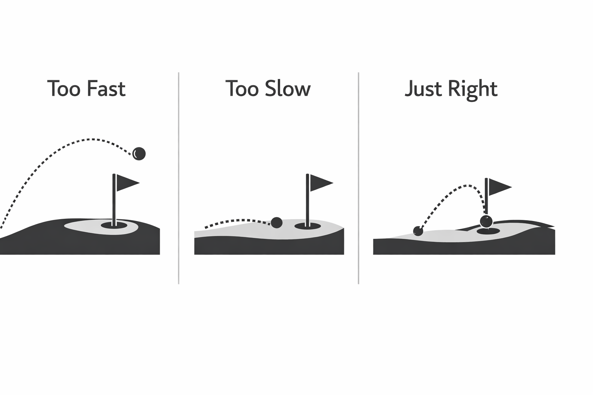
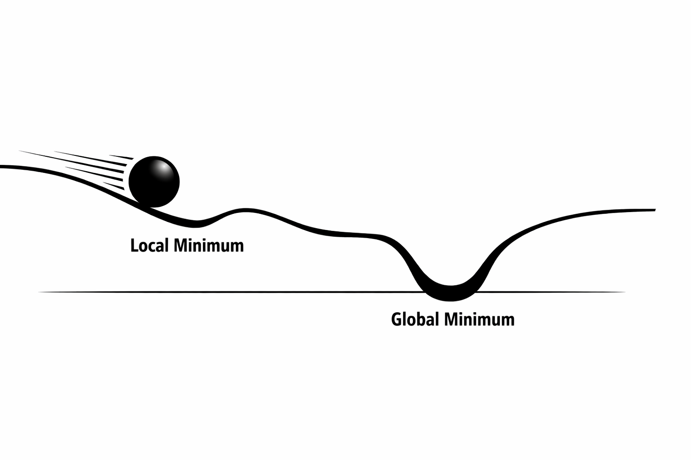
*   **Konuşmacı Notu:** Dağdan aşağı inerken adımlarınızın büyüklüğü (Learning Rate) hayatidir. Çok büyük adımlar atarsanız hedefi ıskalayabilir, hatta savrulabilirsiniz. Çok küçük adımlar atarsanız da hedefe varmanız sonsuza kadar sürer. İdeal dengeyi bulmak gerekir. Bir de **Momentum** kavramımız var. Bunu yokuş aşağı yuvarlanan bir topun kazandığı hız gibi düşünün. Momentum, küçük çukurlara takılmadan (Local Minima) hızla geçmemizi ve ana hedefe (Global Minima) daha kararlı bir şekilde ulaşmamızı sağlar.

### Slide 13: Verinin Dili: Tensörler (Tensors)
*   **Başlık:** PyTorch'un Dili: Tensörler
*   **Görsel:** 0D (Nokta) -> 1D (Çizgi/Dizi) -> 2D (Kare/Matris) -> 3D (Küp/Tensör) evrimini gösteren şık bir geometrik diyagram.
*   **Referans Görsel:** 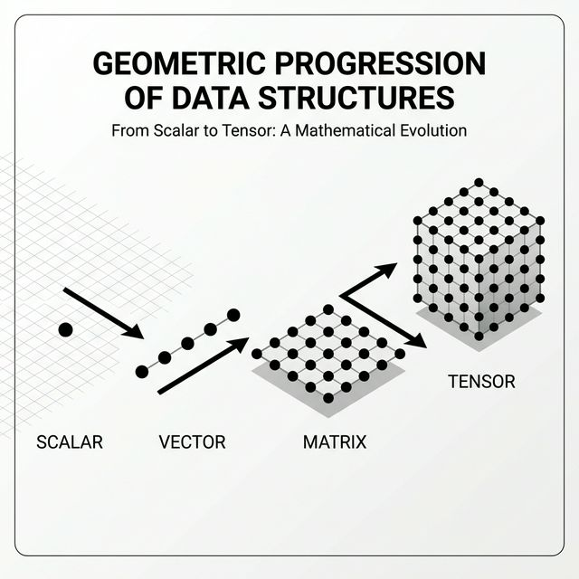
*   **Görsel Promptu:** "Minimalist isometric data structure visualization, 16:9 aspect ratio. A clean progression from left to right: 1. Scalar (A single, isolated white cube). 2. Vector (A single row of cubes). 3. Matrix (A flat grid/plane of cubes). 4. Tensor (A perfect 3D cube composed of multiple stacked grids). All elements are perfectly aligned, using shades of gray, white, and black for depth. Clean, architectural, digital aesthetic."
*   **Konuşmacı Notu:** PyTorch dünyasına hoş geldiniz. Burada dilimiz Tensörler. Matrislerin süper güçlü halidir; çünkü ekran kartında (GPU) ışık hızında işlem görebilirler. Tüm resimler bizim için aslında sayılardan oluşan küplerdir.ı gibi düşünebilirsiniz. Tek bir sayı (skaler), bir liste (vektör), bir excel tablosu (matris) veya renkli bir resim (küp)... Hepsi birer tensördür. Standart dizilerden en büyük farkları gpu üzerinde yaşayabilmeleridir. Yani ekran kartının binlerce çekirdeğini kullanarak ışık hızında matematiksel işlem yapabilirler. Derin öğrenmenin yakıtı budur.

### Slide 14: Veri Paylaşımı ve Bellek
*   **Başlık:** Köprüler: Numpy <-> Tensor
*   **Görsel:** Bir bellek çipi üzerinde iki farklı etiket (Numpy ve Tensor) ama aynı veri bloğunu gösteriyorlar. "Paylaşılan Hafıza" vurgusu.
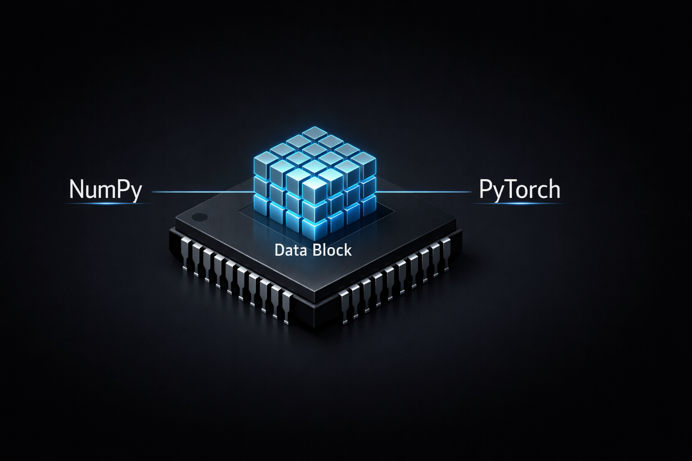
*   **Konuşmacı Notu:** Python dünyasında veriler genellikle NumPy dizileri olarak tutulur. PyTorch, NumPy ile o kadar iyi anlaşır ki, veriyi kopyalamadan birbirlerine dönüştürebilirler. Yani bellekteki aynı veri bloğuna, ister "NumPy Dizisi" isterseniz "PyTorch Tensörü" etiketiyle erişebilirsiniz. Bu "Veri Paylaşımı", özellikle gigabytelarca veriyle çalışırken bellek tasarrufu sağlar ve işlemleri hızlandırır.

### Slide 15: İlk Sinir Ağı: MNIST ve Model Mimarisi
*   **Başlık:** Merhaba Dünya: MNIST Mimarisi
*   **Görsel:** Katmanlı bir ağ yapısı.
    *   Giriş: 784 nöron (28x28 resim).
    *   Gizli Katmanlar: 128 ve 64 nöron (Huni gibi daralıyor).
    *   Çıkış: 10 nöron (0-9 rakamları).
*   **Referans Görsel:** 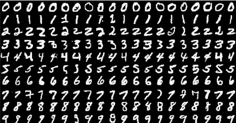 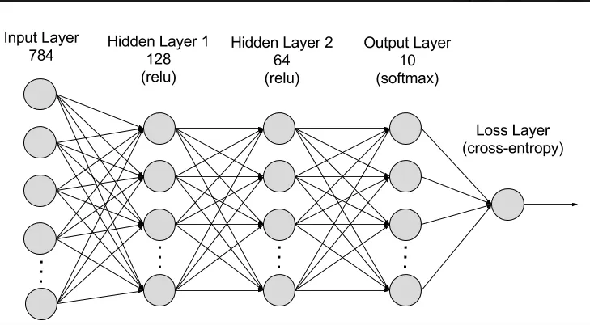
*   **Konuşmacı Notu:** Derin öğrenmenin "Merhaba Dünya"sı MNIST rakamlarıdır. 28x28 piksellik bir resmi düz bir çizgiye çevirir (784 giriş), huni gibi daralan katmanlardan geçirir ve sonunda 10 rakamdan hangisi olduğunu tahmin ederiz.ne kuruyoruz. Modelimiz 28x28 piksellik bir resmi alıyor (784 giriş), bunu nöron katmanlarında işliyor (128 ve 64'lük gizli katmanlar) ve sonunda bu resmin 0'dan 9'a kadar hangi rakam olduğunu tahmin ediyor (10 çıkış). Mimarimiz huni gibi daralan bir yapıda, bilgiyi süzerek özünü çıkarmaya odaklanıyor.

### Slide 16: Model Nasıl Eğitilir? (Döngü)
*   **Başlık:** Eğitim Döngüsü (The Training Loop)
*   **Görsel:** Dairesel bir süreç şeması.
    *   Model Tahmin Yapar -> Loss Hesaplanır -> Autograd (Türev) -> Optimizer (Güncelleme).
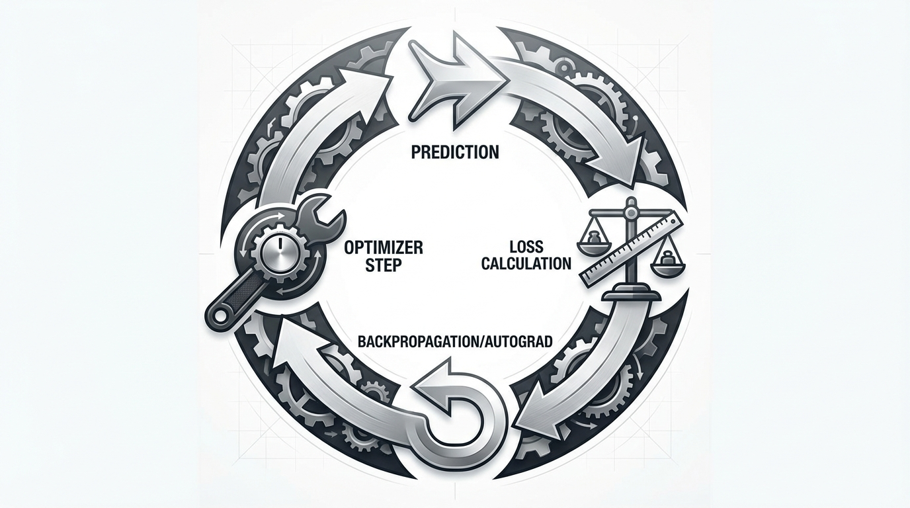
*   **Konuşmacı Notu:** Bir PyTorch eğitim döngüsü 4 kutsal adımdan oluşur ve bu milyonlarca kez tekrarlanır: 1) Model bir tahminde bulunur. 2) Bu tahminin ne kadar yanlış olduğu (Loss) hesaplanır. 3) **Autograd** sihirbazı devreye girer ve hatanın kaynağına giden yolu (türevleri) hesaplar. 4) Son olarak **Optimizer**, bu bilgiyle ağırlıkları günceller ve hatayı düzeltir. Diffusion modellerini eğitirken de aynen bu döngüyü kullanacağız, sadece hesapladığımız şey biraz daha farklı olacak.

### Slide 17: Doğrulama ve Çıkarım (Inference)
*   **Başlık:** Gerçek Hayat Testi: Validation & Inference
*   **Görsel:** Bir büyüteç, bir model kutusunu inceliyor. Üzerinde "no_grad" ve "eval mode" etiketleri asılı.
*   **Referans Görsel:** 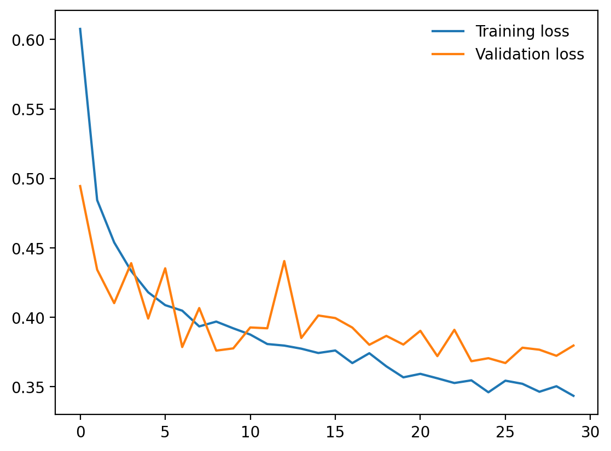
*   **Konuşmacı Notu:** Modeli eğittik, peki gerçekten öğrendi mi? "Validation" setinde test ederiz. Bu sırada `no_grad` ile hafızayı boşaltır, `eval()` ile modeli sınav moduna alırız (kopya çekmek yok, dropout kapalı).tta kullanılmasına **Inference** denir. Bu aşamada artık öğrenme (yani hatayı geri yayma) yoktur. Bu yüzden `no_grad` ile modelin hafızasını kapatırız (daha az bellek harcar) ve `eval()` ile modeli sınav moduna alırız. Bu modda Dropout gibi "eğitim hileleri" devre dışı kalır, model tüm gücüyle en iyi tahminini yapmaya odaklanır.

### Slide 18: Kalıcı Hafıza: Modeli Kaydetmek
*   **Başlık:** Deneyimi Saklamak: Save & Load
*   **Görsel:** Bir beyin simgesi bir sabit diske (Hard Drive) aktarılıyor. Dosya uzantısı `.pth`.
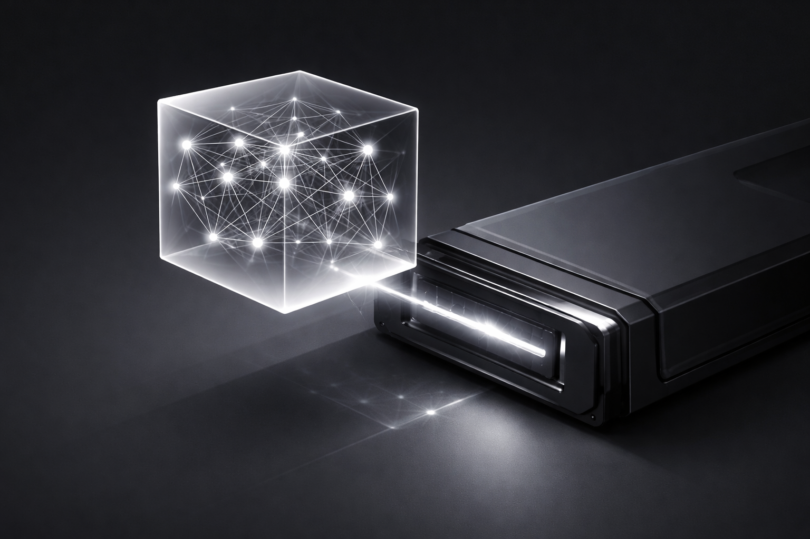
*   **Konuşmacı Notu:** Modelleri eğitmek saatler, günler, hatta (Diffusion gibi dev modellerde) aylar sürebilir. Her seferinde baştan eğitemeyiz. Bu yüzden eğitim bittiğinde modelin "beynini", yani öğrendiği tüm ağırlıkları (`state_dict`) bir dosyaya (.pth) kaydederiz. Gelecekte, bu dosyayı yüklediğimiz anda modelimiz kaldığı yerden, tüm tecrübesiyle birlikte uyanır. Bu, çalışmalarımızın kalıcı olmasını sağlar.

### Slide 19: Veriyi Hazırlamak: Transforms
*   **Başlık:** Veriyi Şekillendirmek: Transforms
*   **Görsel:** Bir fabrikadaki bant sistemi.
    *   Giriş: Farklı boyutlarda dağınık resimler.
    *   İşlem: Boyutlandırma, Kırpma, Tensöre çevirme.
    *   Çıkış: Hepsi aynı boyutta, düzenli kareler.
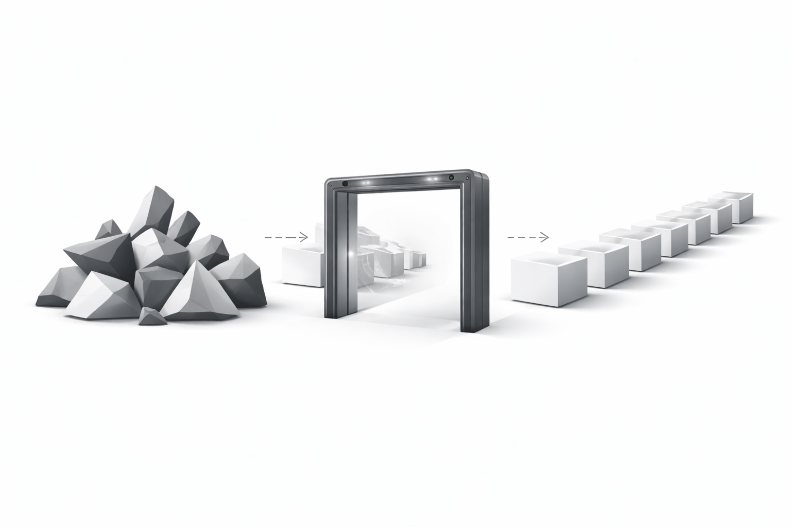
*   **Konuşmacı Notu:** Ham veriler genellikle dağınıktır; resimler farklı boyutlarda olabilir. Modeli beslemeden önce onları bir fabrikadaki montaj hattı gibi **Transforms** işlemlerinden geçiririz. Resimleri standart bir boyuta getirir, kırpar ve en önemlisi onları PyTorch'un anlayacağı matematiksel Tensörlere dönüştürürüz. Bu standartlaştırma, modelin kafasının karışmaması için kritiktir.

### Slide 20: Veriyi Çoğaltmak: Data Augmentation
*   **Başlık:** Veriyi Çoğaltmak: Data Augmentation
*   **Görsel:** Bir kedi fotoğrafının etrafında türevleri: Yan dönmüş, biraz büyütülmüş, rengiyle oynanmış halleri.
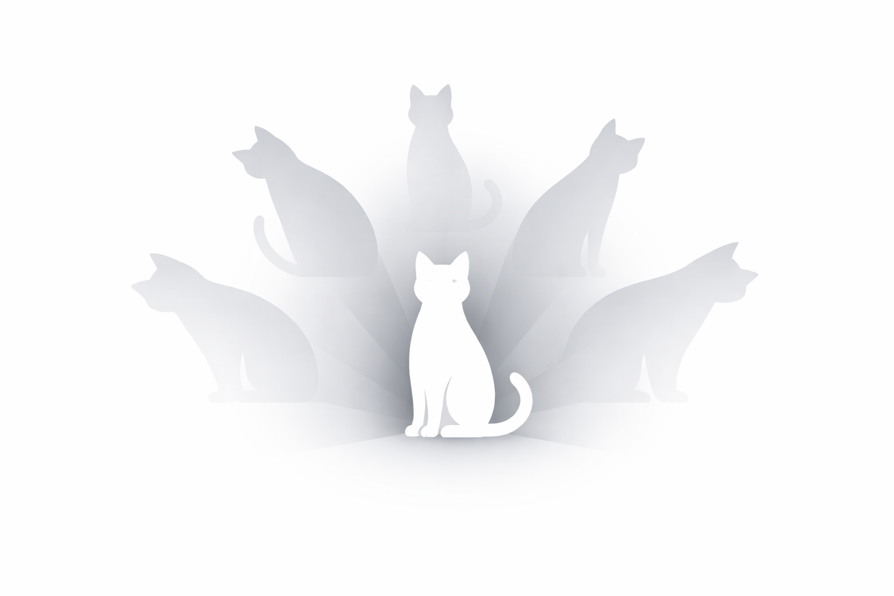
*   **Konuşmacı Notu:** Peki ya elimizde yeterince veri yoksa? O zaman **Data Augmentation** (Veri Artırma) ile veriyi yapay olarak çoğaltırız. Mevcut bir kedi fotoğrafını alır; biraz döndürür, biraz rengini değiştirir, aynalarız. Model için bunların hepsi "yeni" birer örnektir. Bu teknik, modelin ezberlemesini daha da zorlaştırır ve "Kedinin her türlüsünü" (ters, düz, yan) tanımasını sağlar.

### Slide 21: Veriyi Beslemek: Data Loaders
*   **Başlık:** Veri Akışı: Data Loaders
*   **Görsel:** Bir kepçe (Loader), büyük bir kum yığınından (Dataset) küçük paketler (Batches) alıp makineye döküyor. "Shuffle" (Karıştırma) vurgusu.
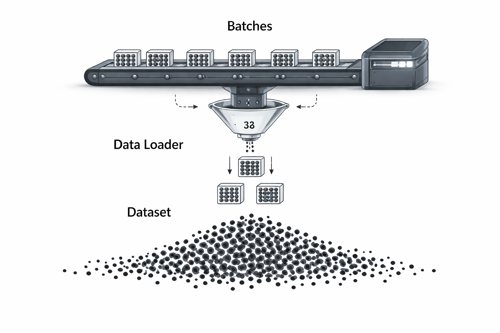
*   **Konuşmacı Notu:** Dönüşümler tamamlandı, verimiz hazır. Ancak elimizde binlerce, belki milyonlarca görsel var. Bunları modele nasıl sunacağız? Tek tek verirsek işlem çok yavaşlar ve güçlü ekran kartlarımızın (GPU) kapasitesini kullanamayız. Hepsini aynı anda yüklemeye çalışırsak da hafıza (RAM) yetmez. İşte **Data Loader**, bu kritik lojistiği yöneten mekanizmadır. Üç temel görevi vardır: **1. Batching (Paketleme):** Verileri "Batch" dediğimiz küçük paketlere böler (Örn: 32'li gruplar). Böylece GPU aynı anda birden fazla veriyi işleyebilir. **2. Shuffling (Karıştırma):** Her eğitim turunda kartları yeniden dağıtır gibi verileri karıştırır. Bu, modelin verilerin sırasını ezberlemesini engeller ve öğrenmeyi genelleştirir. **3. Paralel Yükleme:** Model bir paketi işlerken, Data Loader bir sonraki paketi arkaplanda hazırlar. Böylece veri akışı kesilmez ve sistem maksimum verimle çalışır.

### Slide 22: Miras Almak: Transfer Learning
*   **Başlık:** Devlerin Omuzlarında: Transfer Learning
*   **Görsel:** Büyük, karmaşık bir robotun kafası (Pre-trained Brain) sökülüp, daha basit bir gövdeye takılıyor. Sadece en uçtaki "bağlantı kabloları" (Classifier) değiştiriliyor.
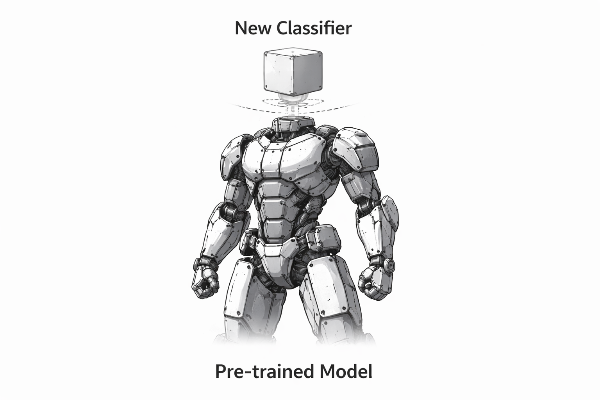
*   **Konuşmacı Notu:** Ve son olarak, günümüz yapay zekasının süper gücü: **Transfer Learning**. Her şeye sıfırdan başlamak zorunda değiliz. Google, Meta gibi devlerin milyonlarca resimle eğittiği, "görmeyi bilen" hazır modelleri (ResNet, VGG vb.) alıyoruz. Sadece en sonundaki karar mekanizmasını söküp, kendi problemimize (Örn: Sadece kedi/köpek ayırma) uygun uçlar takıyoruz. Böylece modelin yılların tecrübesini (kenar, doku, şekil bilgisini) miras alıyor ve çok az veriyle bile mükemmel sonuçlar elde ediyoruz. Diffusion modelleri de bu temelin üzerine inşa edilebiliyor.

### Slide 23: Sorun Ne? (MLP Kısıtlamaları)
*   **Başlık:** Düzleştirmek mi? Asla! (MLP vs CNN)
*   **Görsel:** İki aşamalı bir karşılaştırma:
    1.  **MLP (Multi-Layer Perceptron):** "Mona Lisa" tablosunun kağıt öğütücüden geçip tek uzun bir şeride (vektör) dönüşmesi. Göz ile ağız artık yan yana değil, kilometrelerce uzakta. (Uzamsal bilgi kaybı).
    2.  **CNN (Convolutional Neural Network):** Tablonun olduğu gibi, bütün, kare bir çerçeve içinde tutulması. Piksellerin komşuluk ilişkilerinin korunduğu vurgusu.
*   **Referans Görsel:** 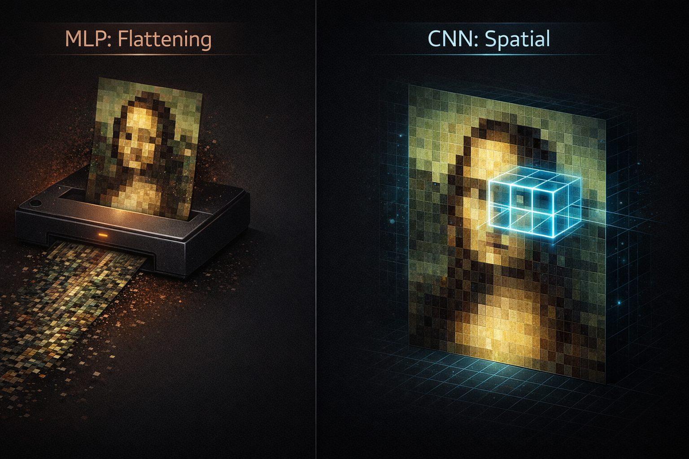
*   **Konuşmacı Notu:** Şimdiye kadar öğrendiğimiz ağların, yani **MLP (Multi-Layer Perceptron - Çok Katmanlı Algılayıcı)**'ların büyük bir kusuru var: Resimleri göremezler! Onları tek boyutlu, uzun bir sayı dizisine (vektör) dönüştürüp dümdüz "okurlar". Düşünün ki Mona Lisa tablosunu alıp ince şeritler halinde kestiniz ve uç uca eklediniz. Evet, tüm boya ve renk oradadır ama "Sanat" ölmüştür. Çünkü gözün burnun neresinde olduğu, dudağın kenarındaki kıvrım gibi **uzamsal (spatial)** bilgileri yok ettiniz. İşte CNN burada devreye girerek "Resmi parçalama, olduğu gibi incele!" der.

### Slide 24: Çözüm: Konvolüsyon (Tarayıcı Gözü)
*   **Başlık:** Resmin Üzerinde Gezinen Göz: Konvolüsyon
*   **Görsel:** Küçük bir pencerenin (Filter/Kernel) büyük bir resim üzerinde kayarak (Sliding) dolaşması ve her noktada bir "özet" çıkarması. `conv_layer.gif` animasyonunun basitleştirilmiş, şematik bir hali.
*   **Referans Görsel:** 
*   **Konuşmacı Notu:** CNN'in kalbinde **Konvolüsyon** işlemi yatar. Bunu, karanlık bir odada el feneriyle duvardaki bir tabloyu incelemek gibi düşünebilirsiniz. Küçük bir pencere (Filtre veya Kernel diyoruz) resmin üzerinde adım adım gezinir. Baktığı o küçük alandaki piksellerle bir matematiksel işlem (çarpma ve toplama) yapar ve tek bir sonuç üretir. Böylece resmin her noktasını tarar ve yerel özellikleri (local features) yakalar.

### Slide 25: Filtreler Ne Görür? (Kenarlar ve Dokular)
*   **Başlık:** Dünyayı Kenarlardan Tanımak
*   **Görsel:** Bir panda fotoğrafının orijinal hali ve yanında "High- Pass Filter" (Yüksek Geçiren Filtre) uygulanmış, sadece kenarların parladığı hali. 
*   **Referans Görsel:** 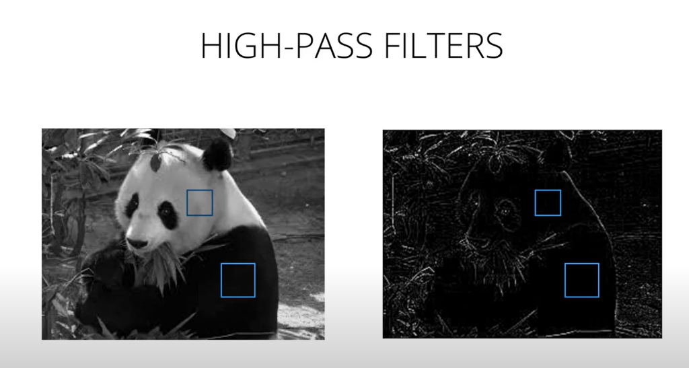
*   **Konuşmacı Notu:** Peki bu "Filtreler" ne işe yarar? Aslında her filtre bir "uzman"dır. Bazısı sadece dikey çizgileri görür, bazısı yatay çizgileri, bazısı renk geçişlerini. Mesela burada bir "Yüksek Geçiren Filtre" görüyoruz; resimdeki ani renk değişimlerini (kenarları) parlatıyor, düz alanları karartıyor. CNN, bu filtreleri elle ayarlamamız gerekmeden, eğitim sırasında kendi kendine öğrenir! Yani "kedi"yi tanımak için hangi kenara bakması gerektiğini kendisi keşfeder.

### Slide 26: Derinlik Kazanmak (Özellik Haritaları)
*   **Başlık:** Çok Boyutlu Bakış: Feature Maps
*   **Görsel:** "Sihirli Lensler" Metaforu. Bir nesneye (örneğin bir araba) bakan, arka arkaya dizilmiş yarı saydam filtre/cam paneller.
    *   Orijinal resim en arkada.
    *   İlk panelde sadece arabanın **kenar çizgileri** neon gibi parlıyor.
    *   İkinci panelde sadece **tekerleklerin dairesel şekli** vurgulanmış.
    *   Üçüncü panelde yüzeyin **dokusu** (texture) ön planda.
    *   Bu panellerin hepsi birleşerek "Özellik Haritası Yığını"nı (Stack) oluşturuyor.
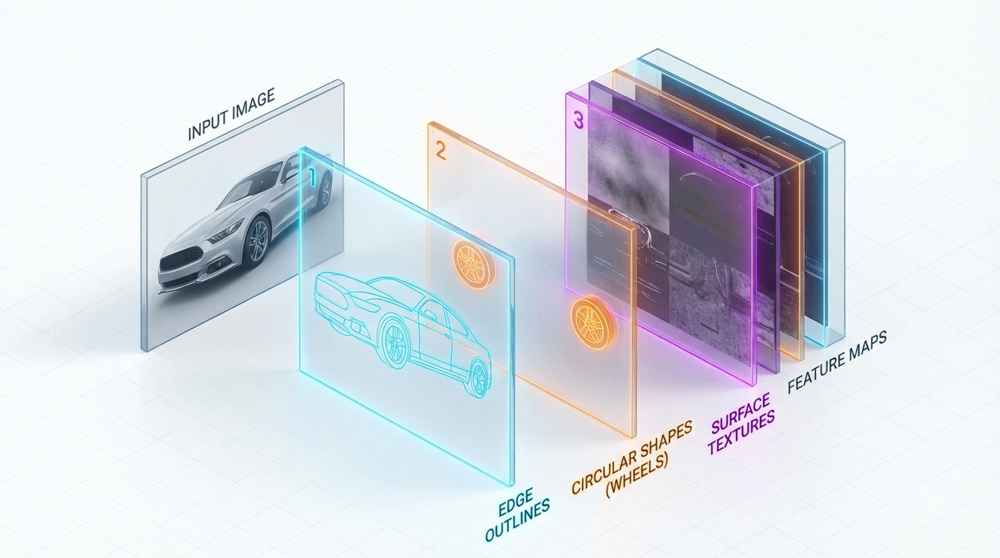
*   **Nano Prompt:** "Minimalist technical illustration, 16:9. A 3D isometric view of an image processing pipeline. An input image of a car passes through 3 separate transparent glass panes floating in sequence. Pane 1 highlights only edge outlines in neon blue. Pane 2 highlights distinctive circular shapes (wheels) in neon orange. Pane 3 highlights surface textures. The panes stack together to form a block called 'Feature Maps'. Clean, high-tech, educational style."
*   **Konuşmacı Notu:** Peki, bu onlarca filtre (convolution) bir araya gelince ne olur? Bunu "Farklı Merceklerle Bakmak" gibi düşünün. CNN, resme tek bir gözle bakmaz; aynı anda takabileceği onlarca farklı gözlüğü vardır.
    *   Bir gözlük sadece **dikey çizgileri** görür.
    *   Diğeri sadece **renk geçişlerini** yakalar.
    *   Bir başkası **yuvarlak şekillere** odaklanır.
    İşte her bir filtrenin yakaladığı bu özel görüntülere **Özellik Haritası (Feature Map)** diyoruz. Başlangıçta elimizde tek bir resim varken, bu katmandan çıktığımızda elimizde o resmin onlarca farklı "yorumu" (bir yığın özelliği) olur. Resim derinleşir, anlam kazanır.

```
S23: "Resmi bozmadan bakmalıyız." (İhtiyaç)
S24: "Bunun için üzerinde minik bir pencere gezdiriyoruz." (Yöntem)
S25: "Bu pencere, mesela kenarları yakalamamızı sağlıyor." (Örnek)
S26: "Bunun gibi onlarca pencereyi aynı anda kullanıp, resmin tüm özelliklerini (derinliğini) çıkarıyoruz." (Sistem)
```

### Slide 27: Özetlemek: Havuzlama (Pooling)
*   **Başlık:** Detaylarda Boğulmamak: Max Pooling
*   **Görsel:** "Özünü Seçmek" Metaforu. Büyük bir ızgaradan (Grid), daha küçük ve yoğun bir ızgaraya geçiş.
    *   Sol tarafta 4x4'lük bir kare ızgara (Matris).
    *   Her 2x2'lik bölgede sadece **bir** kare, diğerlerinden daha parlak/belirgin (Max değer).
    *   Sağ tarafta 2x2'lik daha küçük bir ızgara. Sadece o parlak kareler buraya taşınmış. Diğer sönük kareler elenmiş.
    *   Böylece resim, gereksiz yüklerden kurtulup özüne iniyor.
*   **Nano Prompt:** "Minimalist isometric infographic, 16:9. Visualizing 'Max Pooling' compression. Left: A large 4x4 grid of cubes. In each 2x2 section, only ONE cube is glowing bright white (representing max value), others are dark gray. Right: A smaller 2x2 grid containing ONLY the glowing cubes transferred from the left. Connecting lines show the extraction. High contrast, monochrome aesthetic (black background, white/gray elements), clean geometric style."
*   **Referans Görsel:** 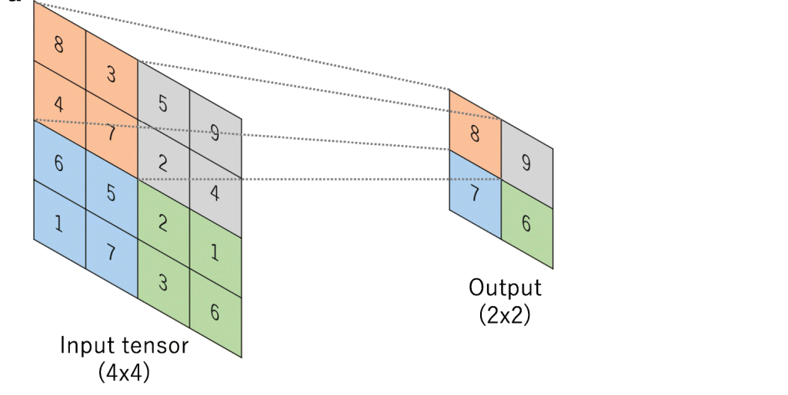
*   **Konuşmacı Notu:** Çok fazla detay bazen kafa karıştırıcıdır. Ayrıca resimlerimiz çok büyükse işlem gücümüz yetmeyebilir. **Pooling** (Havuzlama), resim boyutunu küçültmek ve en baskın özellikleri korumak için kullanılır. En yaygını **Max Pooling**'dir: Küçük bir alana bakar ve oradaki "en güçlü" sinyali (en parlak pikseli) alır, gerisini atar. Tıpkı bir sınavda sadece en yüksek notun dikkate alınması gibi; "Burada önemli bir şey var, detayını boşver, var olduğunu bil yeter" demenin yoludur.

### Slide 28: Büyük Resim: CNN Mimarisi
*   **Başlık:** Parçadan Bütüne: Bir CNN'in Anatomisi
*   **Görsel:** Soldan sağa doğru: Giriş resmi -> Konvolüsyon + ReLU (Özellik Çıkarma) -> Pooling (Küçültme) -> Tekrar Konvolüsyon... -> En sonda Düzleştirme (Flatten) ve Sınıflandırma (FC Layers). Bir araba resminden "ARABA" yazısına giden huni şeklindeki yol.
*   **Referans Görsel:** 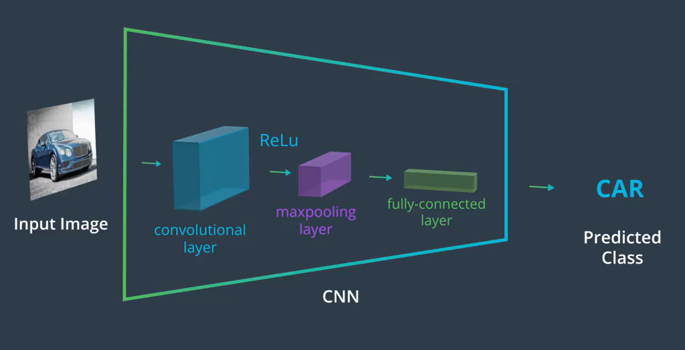
*   **Konuşmacı Notu:** İşte parçaları birleştirdiğimizde ortaya çıkan sanat eseri: **CNN Mimarisi**.
    1.  **Giriş:** Resim girer.
    2.  **Özellik Çıkarma:** Konvolüsyon ve Pooling katmanları ardışık olarak, resimden gitgide daha karmaşık şekilleri (çizgi -> göz -> yüz) öğrenir.
    3.  **Karar:** En sonda elde edilen "özümsenmiş" bilgi düzleştirilir (Flatten) ve klasik bir sinir ağına (MLP) verilerek son karar verilir: "Bu %99 ihtimalle bir arabadır."
    *Yapay Zeka aslında bu kadar basittir: Büyük veriyi al, çiğne, özetle ve karar ver.*

### Slide 29: Boyutları Yönetmek (Stride, Padding & Depth)
*   **Başlık:** Boyut Kontrolü: Stride, Padding & Depth
*   **Görsel:** "Akıllı Tarayıcı" Metaforu. İzometrik bir ızgara üzerinde gezinen bir filtre.
    *   **Padding:** Ana ızgaranın (Resim) etrafını saran yarı saydam, koruyucu bir "Güvenlik Şeridi".
    *   **Stride:** Tarayıcının ızgara üzerinde "sekerek" ilerlemesi (Ayak izleri arasında boşluk var).
    *   **Depth:** Izgaranın tek katlı değil, üst üste dizilmiş 3 katmanlı (RGB Sandviç) bir blok olduğu.
*   **Nano Prompt:** "Minimalist isometric technology illustration, 16:9. A 3D grid data block floating in dark space. Around the block is a semi-transparent 'glass' border (Padding). A neon square frame (Filter) is scanning the top surface, leaving glowing footprints with gaps between them (Stride). The block clearly has vertical depth/layers (Channels). High-tech style, cyan and magenta neon accents on dark grey."
*   **Referans Görsel:** 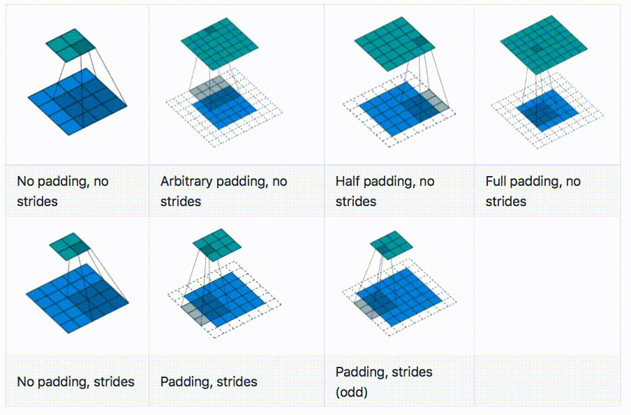
*   **Konuşmacı Notu:** Modelin mimarisini belirlerken boyutları nasıl kontrol ederiz? Üç sihirli ayarımız var:
    1.  **Padding (Dolgu):** Resmin kenarları işlem sırasında kaybolmasın diye etrafına "yapay bir çerçeve" ekleriz (Görseldeki cam çerçeve). Bu sayede resim küçülmez.
    2.  **Stride (Adım):** Filtremiz resim üzerinde kaçar piksel atlayarak geziniyor? Tek tek giderse (Stride 1) detaylı bakar. Atlaya atlaya giderse (Stride 2 - Görseldeki boşluklu izler) hem hızlı gider hem de boyutu küçültür.
    3.  **Depth (Derinlik):** Unutmayın, resimler düz kağıt değil, 3 katmanlı (Kırmızı-Yeşil-Mavi) bloklardır. Filtremiz de bu bloğun tamamını kapsayan bir küp olmak zorundadır.

### Slide 30: Ne Öğrendi? (Özellik Hiyerarşisi)
*   **Başlık:** Görsel Hiyerarşi: Somuttan Soyuta
*   **Görsel:** CNN Aktivasyon Haritaları. Bir insan yüzünün ağın derinliklerine indikçe nasıl dönüştüğünü gösteren 4 aşamalı ızgara.
    *   **Input:** Gülen yüz fotoğrafları (Net, anlaşılır).
    *   **Conv1:** Yüzün sadece ana hatları ve kenarları parlıyor (Çizgisel).
    *   **Conv2:** Gözler, ağız ve burun bölgeleri belirginleşiyor ama görüntü bulanıklaşıyor.
    *   **Conv3:** Görüntü artık piksellere, soyut kutucuklara dönüşüyor. (Biz tanıyamıyoruz ama makine için "kimlik" burada saklı).
*   **Nano Prompt:** "Minimalist data visualization. Four horizontal rows showing image transformation. Row 1: Clear photo of a face. Row 2: The same face interacting with edge detection (blue outlines). Row 3: Coarser, pixelated features (eyes/mouth blobs). Row 4: Highly abstract, low-resolution grid patterns. Arrows indicating flow from top to bottom. High tech medical/AI interface style."
*   **Referans Görsel:** 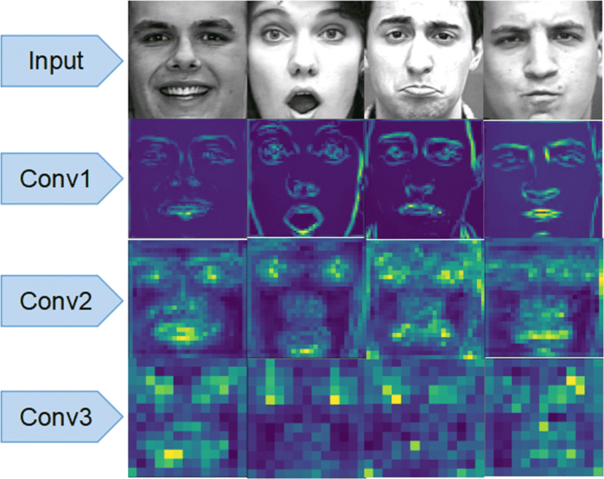
*   **Konuşmacı Notu:** Şimdi modelin zihnine girip, gördüğü şeye bakalım. Bu görselde, bir yüz fotoğrafının katmanlar arasında nasıl "sindirildiğini" görüyorsunuz.
    *   **Conv1 (Yüzey):** Model ilk başta sadece kenarları ve çizgileri görür. "Burada bir şekil var" der.
    *   **Conv2 (Parça):** Biraz derine inince; gözleri, ağzı, burnu ayırt etmeye başlar ama detaylar kaybolur.
    *   **Conv3 (Öz):** En derin katmanda artık resim yoktur, sadece "kavram" vardır. Bizim için anlamsız görünen bu kutucuklar, makine için "Bu kişi Ahmet'tir" demenin matematiksel yoludur. Veriyi soyutlayarak özüne inmiştir.

### Slide 31: Tersten Bakış & Halüsinasyon (Deep Dream)
*   **Başlık:** Yapay Zeka Rüya Görürse: Deep Dream
*   **Görsel:** Normal bir ağaç fotoğrafının, bir CNN filtresini heyecanlandıracak şekilde değiştirilip "halüsinatif" bir binaya/hayvana dönüşmesi.
*   **Referans Görsel:** 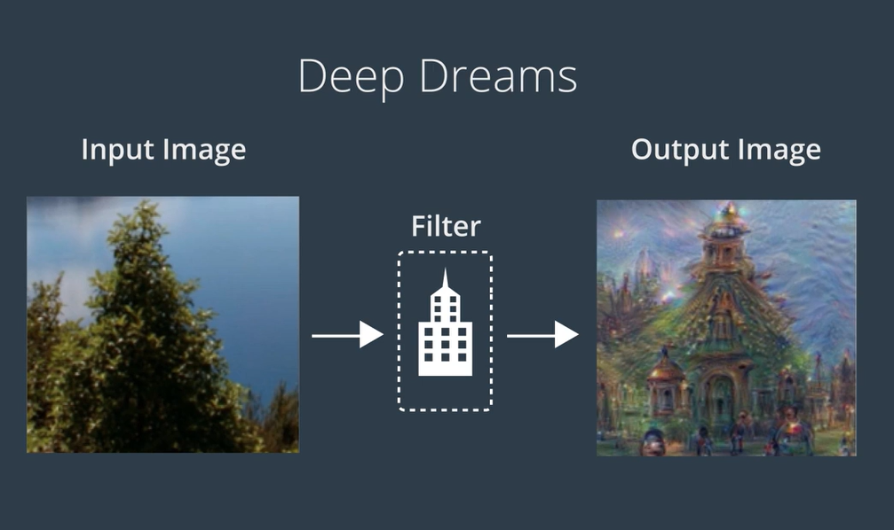
*   **Konuşmacı Notu:** Şimdi sahneye Diffusion için en kritik soruyu atıyorum: **"Bu ağı tersten çalıştırırsak ne olur?"**
    *   Normalde: Resim veririz -> "Kedi" der.
    *   Tersten (Deep Dream): Rastgele gürültü veririz ve **"Bana kedi göster!"** deriz. Model, o gürültünün içindeki kediye benzeyen pikselleri abartarak, hayalindeki kediyi oraya "resmeder".
    *   İşte **Generative AI (Üretken YZ)** budur! Modelin halüsinasyon görmesini sağlıyoruz, ama kontrollü bir şekilde.

### Slide 32: Stil ve İçerik Ayrımı (Content vs Style)
*   **Başlık:** Bir Resmin Ruhu ve Bedeni
*   **Görsel:** Bir yanda bir kedi fotoğrafı (İçerik), diğer yanda "Yıldızlı Gece" tablosu (Stil). Ortada ise "Yıldızlı Gece stilinde bir kedi".
*   **Referans Görsel:** 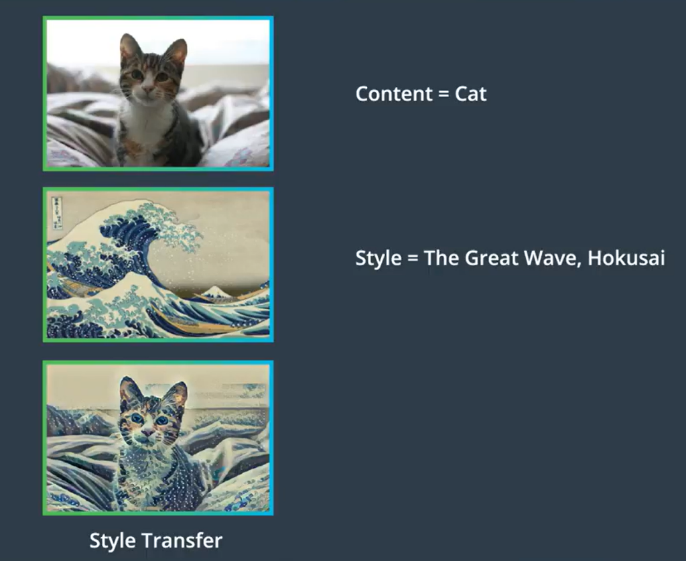
*   **Konuşmacı Notu:** Yapay zeka tarihinde bir diğer devrim: **Style Transfer**. Bir resmin "ne" olduğu (içerik: kedi, bina) ile "nasıl" göründüğünü (stil: fırça darbeleri, renk paleti) birbirinden ayırabiliriz. Bu, Diffusion modellerinin metin (içerik) ve görsel (stil) ilişkisini nasıl kurduğunun atasıdır.

### Slide 33: Stili Matematize Etmek (Gram Matrix)
*   **Başlık:** Van Gogh'un Matematiği: Gram Matrix
*   **Görsel:** Bir CNN katmanının öznitelik haritalarının "düzleştirilmesi" ve birbiriyle çarpılarak bir matris (Gram Matrix) oluşturulması.
*   **Referans Görsel:** 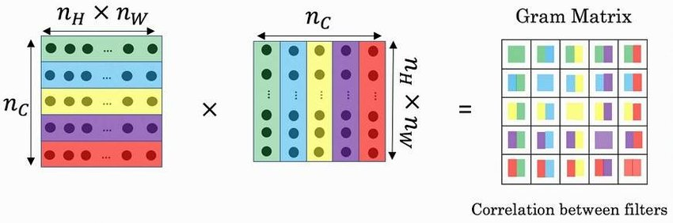
*   **Konuşmacı Notu:** Peki, bir bilgisayara "Van Gogh stili" ne demek, nasıl anlatırız? Cevap: **İstatistiksel Korelasyon**.
    *   "Bu sarı tonu, genellikle şu eğri çizgiyle mi yan yana geliyor?"
    *   Konumdan bağımsız olarak, hangi desenlerin birlikte hareket ettiğine bakarız. Buna **Gram Matrix** diyoruz. Bu matris, resmin "imzasını" taşır.

### Slide 34: Ağ Değil, Resim Eğitmek
*   **Başlık:** Paradigma Değişimi: Sabit Beyin, Değişen Görüntü
*   **Görsel:** Sabit duran bir VGG ağı ve sürekli değişen, gürültüden başlayıp netleşen bir "Hedef Görüntü" (Target Image). Oklar ağın ağırlıklarını değil, resmin piksellerini güncelliyor.
*   **Referans Görsel:** 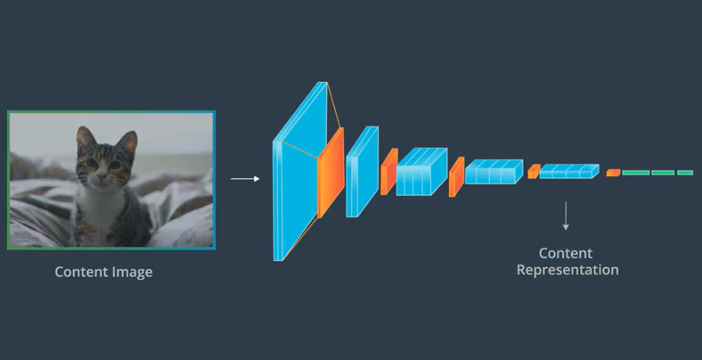
*   **Konuşmacı Notu:** Burası çok önemli! Şimdiye kadar hep "Datayı ver, Ağı eğit" dedik. Ama burada **Ağı donduruyoruz** (eğitmiyoruz).
    *   Bunun yerine **Girdiyi (Resmi) eğitiyoruz**.
    *   Rastgele bir gürültüyle başlıyoruz ve ağa soruyoruz: "Bu resim hem kediye hem de Van Gogh'a benziyor mu?"
    *   Hayır mı? O zaman **Pikselleri değiştir** (ağı değil!).
    *   Bu, Diffusion modellerinin çalışma prensibinin ta kendisidir: Sabit bir model, gürültüyü adım adım anlamlı bir şeye     dönüştürür.

### Slide 35: Kayıp Fonksiyonlarının Dansı (Total Loss)
*   **Başlık:** İki Efendiye Hizmet: Kayıp Dengesi
*   **Görsel:** Bir terazi. Bir kefede "İçerik Kaybı" (Content Loss), diğer kefede "Stil Kaybı" (Style Loss). Farklı ağırlık (Alpha/Beta) oranlarının sonucu nasıl değiştirdiği (Daha çok stil vs Daha çok içerik).
*   **Referans Görsel:** 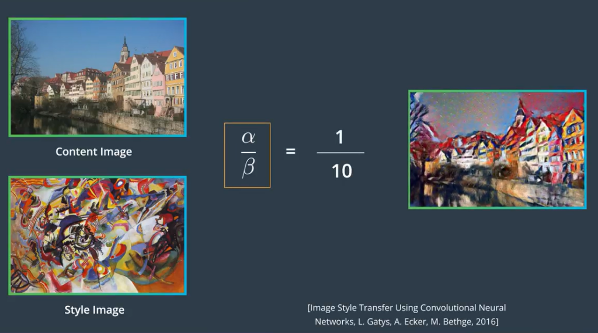
*   **Konuşmacı Notu:** Modelin iki patronu var:
    1.  **İçerik Patronu:** "Orijinal fotoğraftaki kediyi bozma!"
    2.  **Stil Patronu:** "Tablodaki renklere uy!"
    *   Bu ikisi arasında bir denge kurarız (Alpha/Beta oranı).
    *   Diffusion modellerinde de benzer bir denge vardır: "Verdiğim `prompt`a uy" (Guidance Scale) vs "Gerçekçi ol".

### Slide 36: Zamanın Aktığı Yer: RNN
*   **Başlık:** Zamanın İçinde Yolculuk: RNN
*   **Görsel:** Sıralı bir hikaye: "Ayı görüldü" -> "Tilki görüldü" -> "Sırada ne var?". Modelin geçmişteki resimleri (bağlamı) hatırlayarak "Kurt" tahminini yapması.
*   **Referans Görsel:** 
*   **Konuşmacı Notu:** Şu ana kadarki modellerimiz (MLP, CNN) "anlık" yaşıyordu. Bir resme bakıp karar veriyorlardı.
    *   Ama dünya durağan değildir. Videolar, sesler, metinler... Hepsi bir **sıra (sequence)** izler.
    *   Önceki karede "Ayı" gördüysek, orası bir ormandır. Bir sonraki karede "Balina" çıkması mantıksızdır.
    *   **RNN (Recurrent Neural Networks)**, bu "bağlamı" hatırlayan, hafızası olan ilk model türümüzdür.

### Slide 37: Unutkan Yapay Zeka (Vanishing Gradients)
*   **Başlık:** Balık Hafızalı Yapay Zeka
*   **Görsel:** Uzun bir zaman çizelgesi. Başta görülen "Ayı" bilgisi, zaman ilerledikçe silikleşiyor ve sonunda yok oluyor. (Gradient'in kaybolması).
*   **Referans Görsel:** ``
*   **Konuşmacı Notu:** Ancak ilk RNN'lerin büyük bir sorunu vardı: **Unutkanlık**.
    *   Film 2 saat sürüyorsa, filmin başındaki ipucunu sonuna kadar hatırlayamazlardı.
    *   Bilgi, katmanlar arasında aktarılırken matematiksel olarak eriyip gidiyordu (**Vanishing Gradient Problem**).
    *   Bize "Fil Hafızalı" bir model lazımdı.

### Slide 38: Fil Hafızası: LSTM (Long Short-Term Memory)
*   **Başlık:** Kapıları Olan Hücreler: LSTM
*   **Görsel:** Karmaşık bir LSTM hücresi. İçinde "Unutma Kapısı", "Öğrenme Kapısı" ve "Hatırlama Kapısı" var. Bir fil (uzun hafıza) ve bir balık (kısa hafıza) analojisi.
*   **Referans Görsel:** ``
*   **Konuşmacı Notu:** İşte çözüm: **LSTM**.
    *   Bu hücrenin içinde özel **kapılar (gates)** vardır.
    *   Model kendi kendine şu kararları verebilir: "Bu bilgi gereksiz, **Unut!**", "Bu bilgi çok önemli, bunu sakla ve 100 adım sonra **Hatırla!**".
    *   Bu sayede karmaşık ve uzun vadeli ilişkileri (bir kitabın başı ile sonu arasındaki bağlantıyı) öğrenebilirler.

### Slide 39: Geleceği Tahmin Etmek (Next Token Prediction)
*   **Başlık:** Harf Harf Geleceği Yazmak
*   **Görsel:** "To be or not to b..." dizisini alan bir modelin, sıradaki "e" harfini tahmin etmesi.
*   **Referans Görsel:** ``
*   **Konuşmacı Notu:** RNN ve LSTM'ler ile ne yapabiliriz?
    *   En popüler uygulama: **Metin Üretimi**.
    *   "To be or not to" dediğimde, model bir sonraki harfin "b" olduğunu tahmin eder. Sonra "be" olur.
    *   Bu **sıralı üretim (sequential generation)** mantığı, Diffusion modellerinin de kalbinde yatar. Orada harf yerine "gürültüden arındırılmış pikseller" üretiriz, ama mantık aynıdır: Adım adım, sabırla sonuca gitmek.

---

## Bölüm 2: Unit 1 - Diffusion Modelleri Giriş
*Amaç: Kod yok, matematik yok; bol görselle Unit 1'i sezgisel anlatmak.*

### Slide 40: Giriş
*   **Başlık:** Bu Bölümde Neler Göreceğiz?
*   **Altbaşlık:** Diffusion Modellerine Görsel Bir Yolculuk
*   **Görsel:** 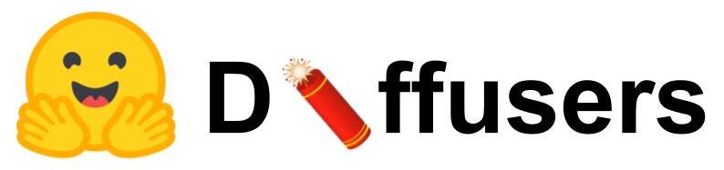
*   **Konuşmacı Notu:**
    *   Merhaba, bu sunumda Hugging Face "Diffusion Models" kursunun 1. Ünitesini özetleyeceğiz.
    *   Karmaşık kodlara girmeden, sistemin "nasıl düşündüğünü" anlayacağız.
    *   Gürültüden (kaostan) anlamlı bir görüntüye nasıl gidildiğini göreceğiz.
    *   Sıfırdan bir modelin nasıl eğitildiğine ve `diffusers` kütüphanesinin rolüne bakacağız.

### Slide 41: Hedefimiz Ne?
*   **Başlık:** Hayal Gücünü Modele Dökmek
*   **Altbaşlık:** Neden Diffusion Modelleri?
*   **Görsel:** 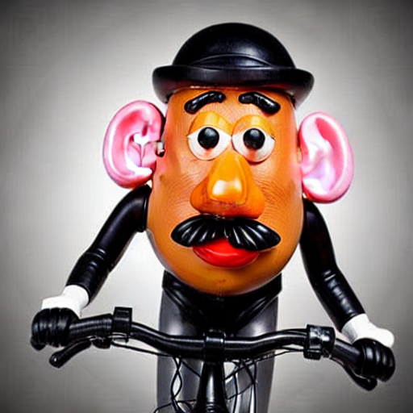
*   **Konuşmacı Notu:**
    *   Amacımız, yapay zekaya yeni kavramlar öğretebilmek.
    *   Örneğin, sadece birkaç fotoğrafını gösterdiğimiz bir oyuncağı (Mr. Potato Head), modelin bambaşka durumlarda (bisiklet sürerken) çizebilmesini istiyoruz.
    *   Bu, modelin sadece kopyalamadığını, nesneyi "anladığını" gösterir.

### Slide 42: Temel Mantık (Gürültü)
*   **Başlık:** Düzen ve Kaos Arasındaki Dans
*   **Altbaşlık:** Gürültü Ekleme ve Kaldırma
*   **Görsel:** 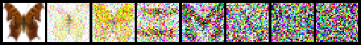
*   **Konuşmacı Notu:**
    *   Diffusion modellerinin kalbinde iki yönlü bir yolculuk var.
    *   **İleri Yol:** Elimizdeki temiz bir resmi yavaş yavaş bozarak tanınmaz hale (saf gürültüye) getiriyoruz.
    *   **Geri Yol:** Modelin asıl işi bu süreci tersine çevirmek; yani gürültüden tekrar kelebeğe dönmeyi öğrenmek.

### Slide 43: Bozma Süreci (Forward Process)
*   **Başlık:** Veriyi Yavaşça Yok Etmek
*   **Altbaşlık:** Adım Adım Karıncalanma
*   **Görsel:** 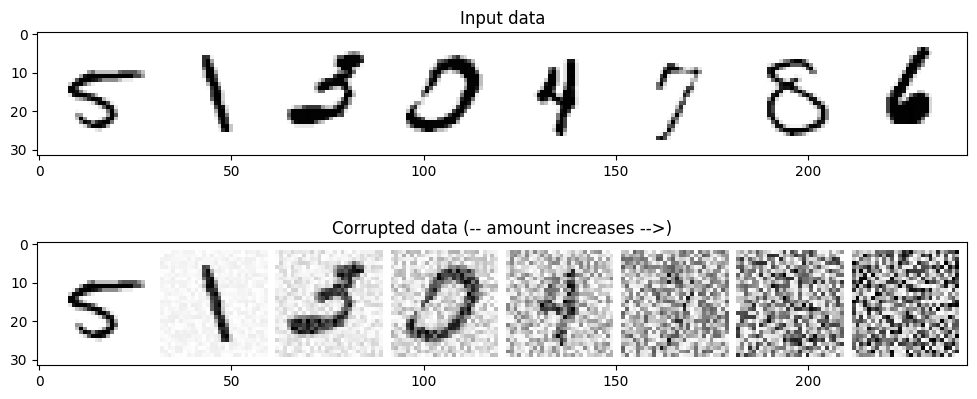
*   **Konuşmacı Notu:**
    *   Bir veriyi (örneğin el yazısı bir "5" rakamını) alıyoruz.
    *   Üzerine rastgele noktalar (karıncalanma) ekliyoruz.
    *   En sağa gittiğimizde artık elimizde sadece rastgele bir gürültü yumağı kalıyor. Model için eğitim verisi işte böyle hazırlanıyor.

### Slide 44: Modelin Görevi
*   **Başlık:** Kaosun İçindeki Düzeni Görmek
*   **Altbaşlık:** Tahmin Etme Oyunu
*   **Görsel:** 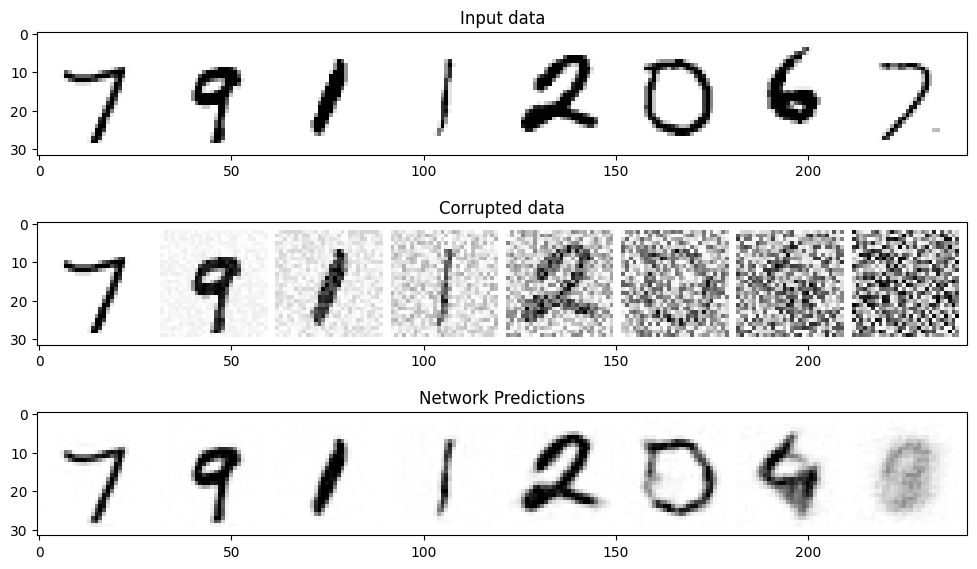
*   **Konuşmacı Notu:**
    *   Eğitim sırasında modele farklı gürültü seviyelerinde bozulmuş görüntüler veriyoruz.
    *   Model, her seviyedeki gürültüyü tahmin etmeyi öğreniyor.
    *   Soldaki az gürültülü tahminler net, sağdaki çok gürültülü tahminler bulanık.

### Slide 45: Mimarimiz (Basit Bakış)
*   **Başlık:** Modelin İskeleti: UNet
*   **Altbaşlık:** Bilgiyi Sıkıştır ve Genişlet
*   **Görsel:** 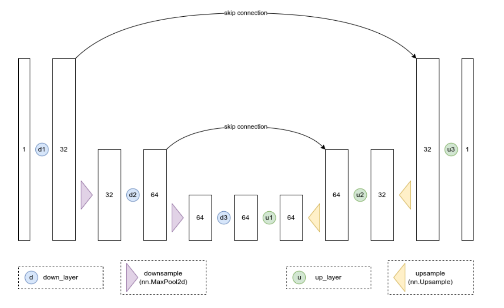
*   **Konuşmacı Notu:**
    *   Bu işi yapan modelin yapısına "UNet" diyoruz çünkü şekli "U" harfine benziyor.
    *   Sol taraf: Resmi küçülterek (sıkıştırarak) en önemli özelliklerini (bir rakamın eğimi, bir kelebeğin kanadı gibi) özetliyor.
    *   Sağ taraf: Bu özeti alıp tekrar orijinal resim boyutuna genişletiyor.

### Slide 46: Mimarinin Detayı
*   **Başlık:** Bağlantıların Önemi
*   **Altbaşlık:** Skip Connections (Kestirme Yollar)
*   **Görsel:** 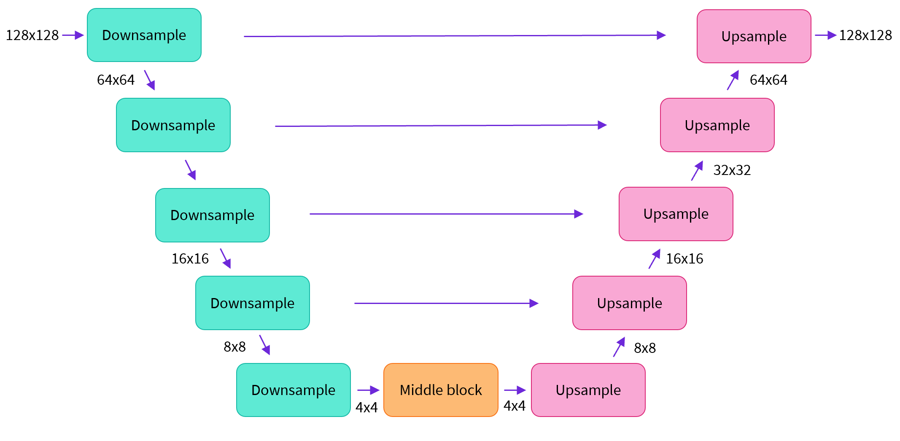
*   **Konuşmacı Notu:**
    *   Resmi sıkıştırırken detayları kaybetme riski vardır.
    *   Bu yüzden modelde "Kestirme Yollar" (oklarla gösterilen çizgiler) bulunur.
    *   Bu yollar, giriş kısmındaki detaylı bilgiyi, çıkış kısmına doğrudan aktararak resmin net olmasını sağlar.

### Slide 47: Zamanlama (Scheduler)
*   **Başlık:** Ne Kadar Gürültü?
*   **Altbaşlık:** Zamanlayıcının Rolü
*   **Görsel:** 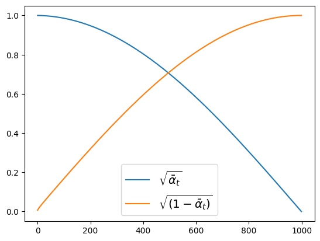
*   **Konuşmacı Notu:**
    *   Resme bir anda çok fazla gürültü eklersek model şaşırır.
    *   "Scheduler" (Zamanlayıcı), gürültünün ne kadar hızlı ekleneceğini ve çıkarılacağını yönetir.
    *   Grafikteki çizgiler, zaman ilerledikçe resmin (mavi) azaldığını, gürültünün (turuncu) arttığını gösteriyor.

### Slide 48: Eğitim Performansı
*   **Başlık:** Hatalardan Ders Çıkarmak
*   **Altbaşlık:** Loss (Kayıp) Grafiği
*   **Görsel:** 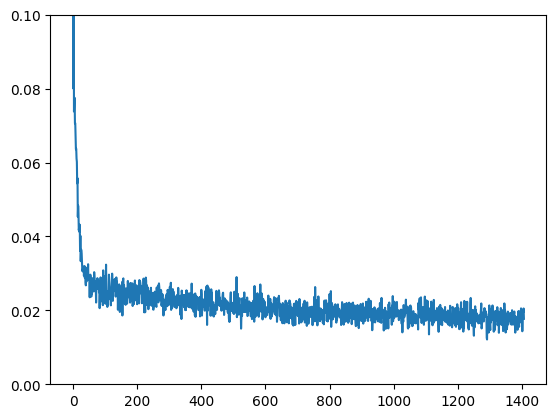
*   **Konuşmacı Notu:**
    *   Model eğitilirken sürekli tahmin yapar ve sonucunu gerçek resimle karşılaştırır.
    *   Aradaki farka "Loss" (Hata/Kayıp) denir.
    *   Grafiğin aşağı inmesi, modelin artık gürültüyü daha iyi tanıdığını ve hatasının azaldığını gösterir.

### Slide 49: Üretim Süreci (Az Adım)
*   **Başlık:** Görüntünün Doğuşu
*   **Altbaşlık:** 5 Adımda Örnekleme
*   **Görsel:** 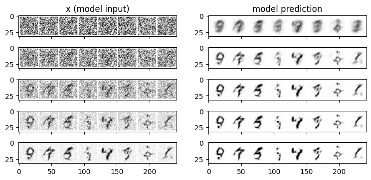
*   **Konuşmacı Notu:**
    *   Eğitim bitti, şimdi yeni bir resim üretmek istiyoruz.
    *   Tamamen rastgele bir gürültüden başlıyoruz.
    *   Sadece 5 adımda bile, model o kaosun içinden belirgin şekiller (rakamlar) çıkarmaya başlıyor.

### Slide 50: Üretim Süreci (Çok Adım)
*   **Başlık:** Sabırla İyileştirme
*   **Altbaşlık:** 40 Adımda Örnekleme
*   **Görsel:** 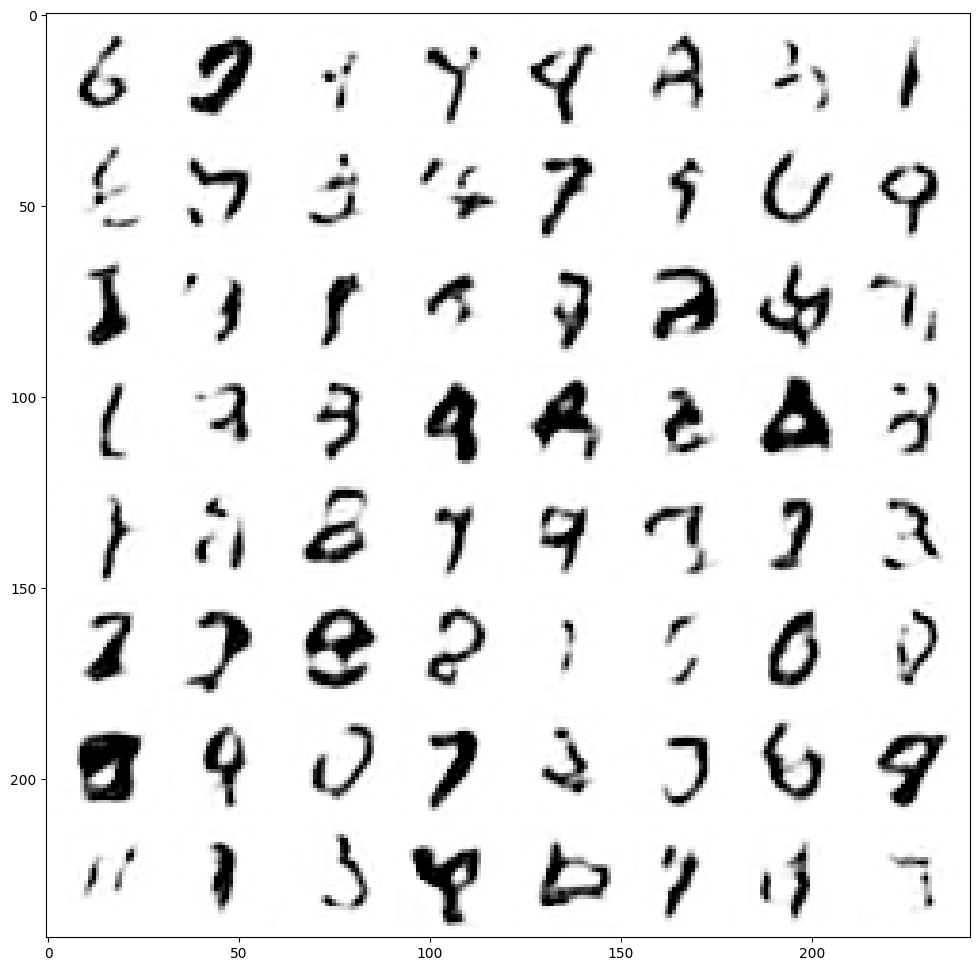
*   **Konuşmacı Notu:**
    *   Adım sayısını artırırsak (5'ten 40'a), model her adımda resmi biraz daha temizler.
    *   Bulanık lekeler, net ve okunabilir el yazısı rakamlarına dönüşür.
    *   Bu süreç, bir heykeltıraşın ham mermerden yavaşça heykeli ortaya çıkarmasına benzer.

### Slide 51: Sonuçlar (MNIST)
*   **Başlık:** Sıfırdan Zirveye
*   **Altbaşlık:** Üretilen Rakamlar
*   **Görsel:** 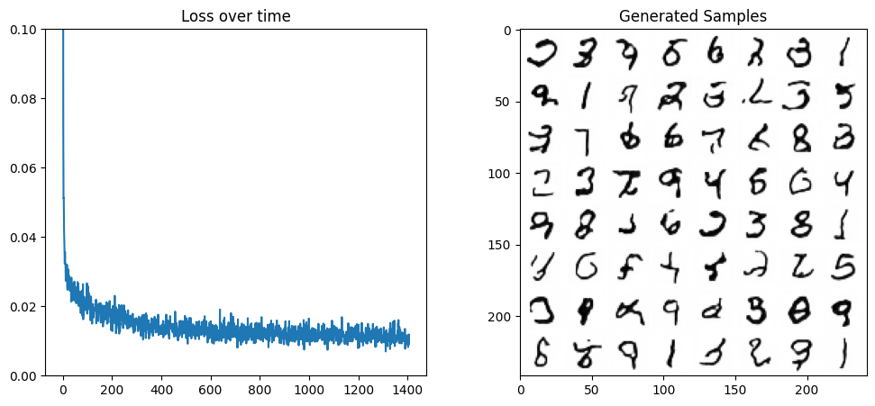
*   **Konuşmacı Notu:**
    *   İşte sonuç!
    *   Bu gördüğünüz rakamların hiçbiri gerçek bir insan tarafından yazılmadı.
    *   Model, gürültüden başlayarak "el yazısı rakamı" kavramını hayal etti ve çizdi.

### Slide 52: Renkli Sonuçlar (Kelebekler)
*   **Başlık:** Daha Karmaşık Hayaller
*   **Altbaşlık:** Kelebek Üretimi
*   **Görsel:** 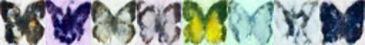
*   **Konuşmacı Notu:**
    *   Aynı mantığı sadece siyah beyaz rakamlara değil, renkli kelebek resimlerine de uygulayabiliriz.
    *   `diffusers` kütüphanesi sayesinde, model farklı renk ve desenlerde, daha önce hiç var olmamış kelebekler üretebilir.

### Slide 53: Paylaşım ve Topluluk
*   **Başlık:** Eseri Dünyayla Paylaşmak
*   **Altbaşlık:** Hugging Face Hub
*   **Görsel:** 
*   **Konuşmacı Notu:**
    *   Eğittiğimiz modeli kendimize saklamak zorunda değiliz.
    *   Hugging Face Hub üzerine yükleyerek (Model Card oluşturarak), dünyanın her yerindeki insanların bizim modelimizi kullanmasını ve geliştirmesini sağlayabiliriz.

### Slide 54: Kapanış
*   **Başlık:** Yolculuğun İlk Durağı Bitti
*   **Altbaşlık:** Unit 1 Tamamlandı -> Sırada Unit 2 Var
*   **Konuşmacı Notu:**
    *   Unit 1'de Diffusion modellerinin temel mantığını, gürültüden nasıl resim oluşturulduğunu ve UNet mimarisini öğrendik.
    *   Sıfırdan bir model eğittik ve sonuçları gördük.
    *   Unit 2'de (Fine-Tuning), bu modelleri kendi özel verilerimizle nasıl daha spesifik hale getireceğimizi öğreneceğiz. Teşekkürler.

---

## Bölüm 3: Unit 2 - Kontrol ve İnce Ayar (Control & Customization)
*Amaç: Kod yok, matematik yok; hikaye anlatımıyla Unit 2'yi sezgisel anlatmak.*

### Slide 55: Giriş ve Hedef
*   **Başlık:** Modeli Kontrol Altına Almak
*   **Altbaşlık:** Fine-Tuning ve Yönlendirme (Guidance)
*   **Görsel:** 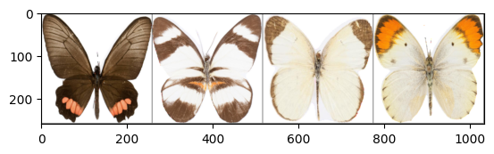
*   **Konuşmacı Notu:**
    *   Hoş geldiniz. İlk bölümde sıfırdan bir modelin nasıl öğrendiğini görmüştük.
    *   Şimdi ise elimizdeki "genel yetenekli" bir modeli, kendi özel ihtiyaçlarımız (örneğin sadece kelebek üretmek) için nasıl uzmanlaştıracağımızı göreceğiz.
    *   Bu bölümde iki ana süper güç kazanacağız: **Fine-Tuning** (İnce Ayar) ve **Guidance** (Rehberlik).

### Slide 56: Fine-Tuning Nedir?
*   **Başlık:** Yeni Bir Sanat Öğretmek
*   **Altbaşlık:** Var Olan Bilgiyi Özelleştirme
*   **Anahtar Maddeler:** yüz modeli üreten bir model, sanatsal bir style, fine tune
*   **Görsel:** 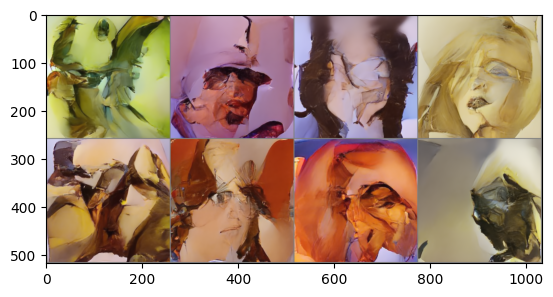
*   **Konuşmacı Notu:**
    *   Elimizde yatak odası resimleri çizmek için eğitilmiş bir model olduğunu düşünün.
    *   Biz bu modele "sanatsal tablolar" çizmeyi öğretmek istiyoruz. Sıfırdan başlamak yerine, modelin mevcut çizim yeteneğini alıp, ona sadece yeni stilimizi (sanat eserlerini) gösteriyoruz.
    *   Bu sürece "Fine-Tuning" diyoruz; model eski bilgisini unutmuyor ama yeni bir alana odaklanıyor.

### Slide 57: Eğitim Zorlukları
*   **Başlık:** Öğrenme Süreci Her Zaman Pürüzsüz Değildir
*   **Altbaşlık:** Loss (Hata) Grafiğindeki Gürültü
*   **Anahtar Madde:** az veri ile finetune = kafa karışıklığı
*   **Görsel:** 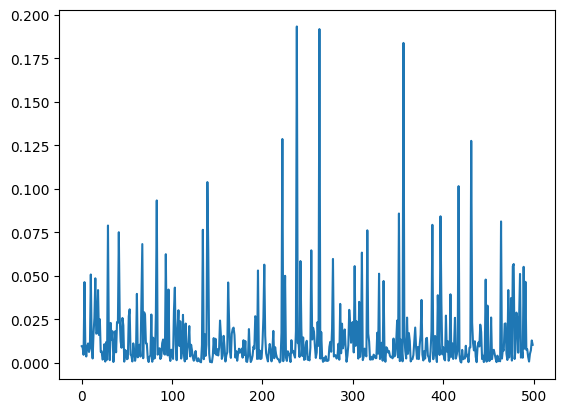
*   **Konuşmacı Notu:**
    *   Az sayıda veriyle (örneğin sadece 1000 kelebek) modele ince ayar yaparken işler her zaman yolunda gitmeyebilir.
    *   Grafikteki bu zikzaklar, modelin öğrenirken kafasının karıştığını gösteriyor.
    *   Model bazen çok iyi tahminler yaparken, bir sonraki adımda tamamen saçmalayabiliyor. Bu, "az veriyle çalışmanın" doğasında var.

### Slide 58: Fine-Tuning Sonuçları
*   **Başlık:** Dönüşümü İzlemek
*   **Altbaşlık:** Yatak Odalarından Sanat Eserlerine
*   **Görsel:** 
*   **Konuşmacı Notu:**
    *   Hata grafiği dalgalı olsa da, sonuçlara baktığımızda modelin değiştiğini görüyoruz.
    *   Başlangıçta fotoğraf gibi duran görüntüler, eğitim ilerledikçe fırça darbelerine ve soyut sanat eserlerine dönüşüyor.
    *   Model artık "fotoğraf" çizmeyi bırakıp "tablo" yapmaya başladı. Fine-tuning başarılı oldu.

### Slide 59: Guidance (Yönlendirme) Giriş
*   **Başlık:** Modeli Dürtmek
*   **Altbaşlık:** Üretim Sürecine Müdahale
*   **Anahtar Maddeler:** O Anki Çizimi Değiştirmek, Yeniden Eğitim Yok, Pikselleri Hafifçe İtmek
*   **Görsel:** 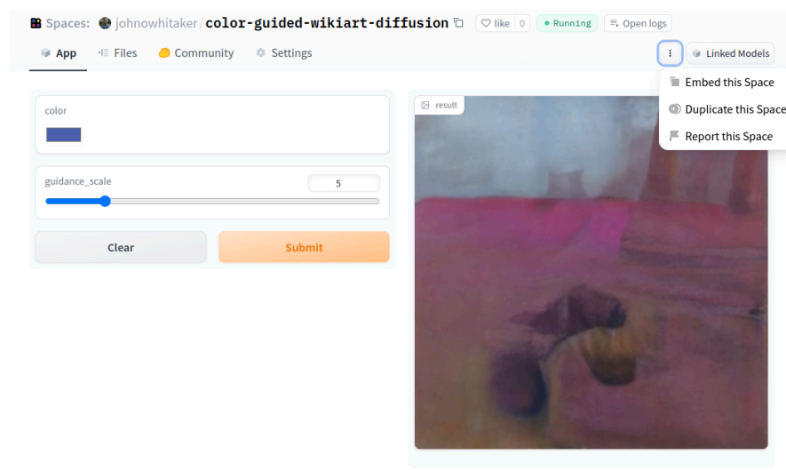
*   **Konuşmacı Notu:**
    *   Fine-tuning ile modelin *tümünü* değiştirdik. Peki ya sadece o anki çizimi değiştirmek istersek?
    *   Buna "Guidance" (Yönlendirme) diyoruz.
    *   Örneğin modele şunu diyebiliriz: "Ne çizersen çiz, ama rengi **pembe** olsun."
    *   Modeli yeniden eğitmiyoruz, sadece çizerken elini biraz sağa veya sola itiyoruz.

### Slide 60: Metin ile Yönlendirme (CLIP Guidance)
*   **Başlık:** Kelimelerle Resim Çizdirmek
*   **Altbaşlık:** CLIP Modelinin Gücü
*   **Anahtar Maddeler:** Kelimelerle Yönlendirme, "Güle Benzedi mi?" Kontrolü, Adım Adım Düzeltme
*   **Görsel:** 
*   **Konuşmacı Notu:**
    *   Sadece renk değil, kelimelerle de yönlendirme yapabiliriz.
    *   "Bana bir gül çiz" dediğimizde, CLIP adı verilen yardımcı bir model devreye giriyor.
    *   Çizim her adımda "Güle benzedi mi?" diye kontrol ediliyor ve model ona göre düzeltiliyor. Sonuçta soyut da olsa güle benzeyen formlar ortaya çıkıyor.

### Slide 61: Kontrolün Dozu
*   **Başlık:** Ne Kadar Müdahale Etmeliyiz?
*   **Altbaşlık:** Guidance Ölçekleri
*   **Görsel:** 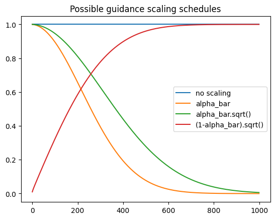
*   **Konuşmacı Notu:**
    *   Modele ne kadar karışacağımız önemlidir.
    *   Çok fazla müdahale edersek resim bozulur (sadece renk yığını olur). Çok az karışırsak dediğimizi yapmaz.
    *   Bu grafik, çizimin başından sonuna kadar müdahale şiddetini nasıl ayarlayabileceğimizi gösteriyor (örneğin başta çok karış, sonda serbest bırak).

### Slide 62: Sınıf Koşullandırma (Class Conditioning) Giriş
*   **Başlık:** Modele “Ne Çizmesini” Söylemek
*   **Altbaşlık:** 0’dan 9’a: Aynı Fırça, Farklı İstek
*   **Görsel:** 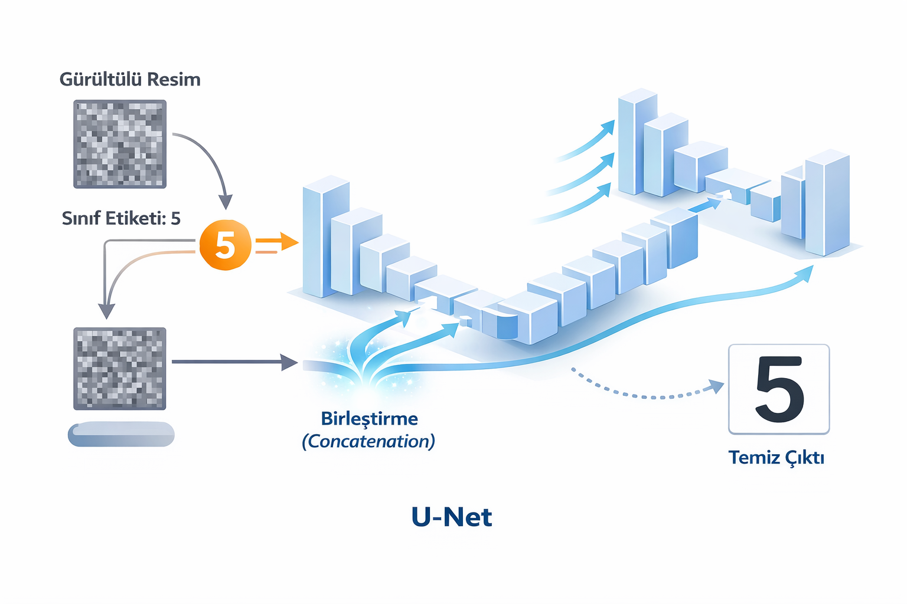
*   **Konuşmacı Notu:**
    *   Guidance ile modele “şöyle olsun” diye dürtük veriyorduk. Şimdi daha net bir komut düşünün: “Bana *7* çiz.”
    *   Buradaki fikir şu: Model sadece “gürültüyü temizlemeyi” değil, *hangi sınıfı* (hangi rakamı) hedeflediğini de bilerek temizlemeyi öğreniyor.
    *   Yani tek bir model var; ama eline bir de “etiket kartı” veriyoruz. Model o karta bakıp doğru yöne doğru toparlanıyor.

### Slide 63: Etiketi Modelin Anlayacağı Dile Çevirmek
*   **Başlık:** Sayı Etiketi → Anlam Vektörü
*   **Altbaşlık:** “7” Demek, Modele Ne Demek?
*   **Görsel:** 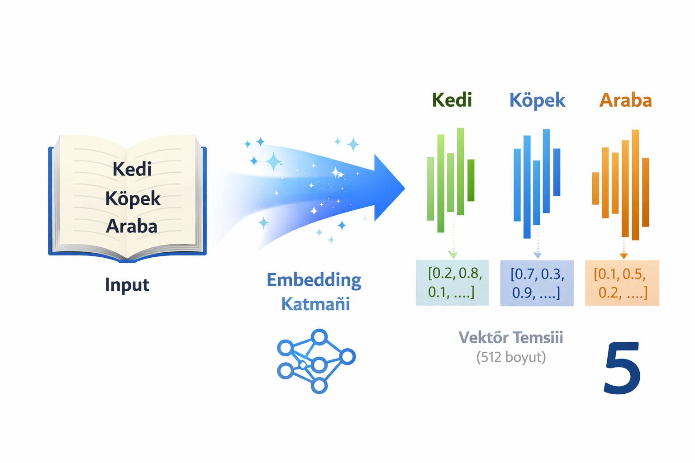
*   **Konuşmacı Notu:**
    *   Model için “7” tek başına sihirli bir kelime değil; onu, öğrenilebilir bir “anlam parçasına” çevirmemiz gerekiyor.
    *   Bu görseldeki fikir: Her sınıf (0–9) küçük bir temsil (embedding) ile ifade ediliyor.
    *   Sonra bu temsil, görüntüyle birlikte modele veriliyor: Model, “temizlerken” aynı zamanda “hangi hedefe yaklaşacağını” da hissediyor.

### Slide 64: Üretimde Kontrol: ‘Hangi Rakam?’
*   **Başlık:** Tek Model, On Farklı Sonuç
*   **Altbaşlık:** Üretimde Etiketi Değiştir, Çıktıyı Değiştir
*   **Görsel:** 
*   **Konuşmacı Notu:**
    *   Eğitim bittiğinde büyü başlıyor: Üretim sırasında sadece etiketi değiştirerek “0 üret”, “3 üret”, “9 üret” diyebiliyoruz.
    *   Süreç aynı kalıyor: Gürültüden başlayıp adım adım temizleniyor; ama her adımda hedef rakamın “çekim alanı” devrede oluyor.
    *   Sonuç olarak, rastgele başlayan çizim yolculuğu daha en baştan “hangi sınıfa” gideceğini biliyor; bu da kontrolü somut ve güvenilir hale getiriyor.

### Slide 65: Özet
*   **Başlık:** Kontrol Etmenin 3 Yolu
*   **Altbaşlık:** Modeli Değiştir, Dürt, Ya da Etiket Ver
*   **Konuşmacı Notu:**
    *   Bu bölümde “kontrol” fikrini üç farklı bakışla gördük:
    *   **Fine-tuning:** Modelin davranışını kalıcı olarak değiştirir (uzmanlaştırır).
    *   **Guidance:** Üretim anında modele yön verir (o anki çizimi ittirir).
    *   **Class conditioning:** Modele net bir hedef etiketi verir (örn. “7 üret”).
    *   Ortak nokta: Hepsi, gürültüden çıkan görüntüyü “istenen şeye” daha güvenle yaklaştırmanın farklı yolları.

---

## Bölüm 4: Teoriden Pratiğe - MR-CDI Projesi
*Amaç: Eğitimlerde öğrendiğim kavramların, hocamın MR-CDI + tES projesinde hangi noktalara oturduğunu göstermek (paralellikler, sektörde kullanım örüntüleri ve benim katkı alanım).*

### Slide 66: Bölüm Başlangıcı - Köprüyü Kurmak
*   **Başlık:** Teoriden Pratiğe: Lab Problemine Köprü
*   **Görsel:** Modern bir köprü görseli. Solda "Deep Learning + Diffusion" etiketi, sağda "MR-CDI + tES" etiketi. Ortada "Inverse Problem" yazan bir kilit taşı.
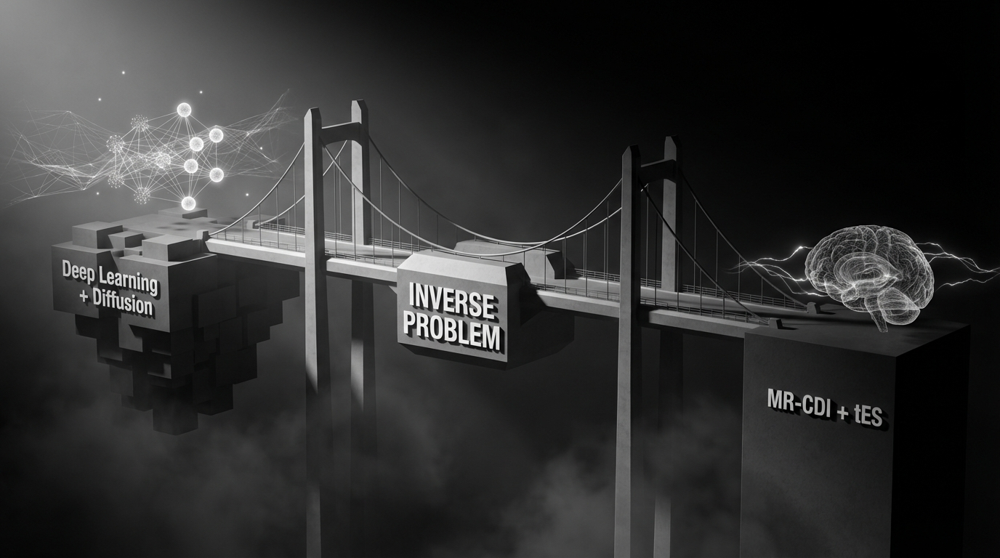
*   **Konuşmacı Notu:** Bu bölümde amacım şu: Eğitimlerde öğrendiğim diffusion kavramlarını, hocamın projesinin gerçek ihtiyacıyla eşlemek. Yani “Bu öğrendiklerim projede nerede işe yarar?” sorusuna net cevap vermek.

### Slide 67: Proje (1 Cümle) - Ne Yapıyoruz?
*   **Başlık:** MR-CDI ile Akım Haritası (J) Üretmek
*   **Görsel:** Tek bir yatay pipeline:
    *   **Girdi:** tES (electrodes + current) + MRI measurement
    *   **Çıktı:** Current Density Map (J)
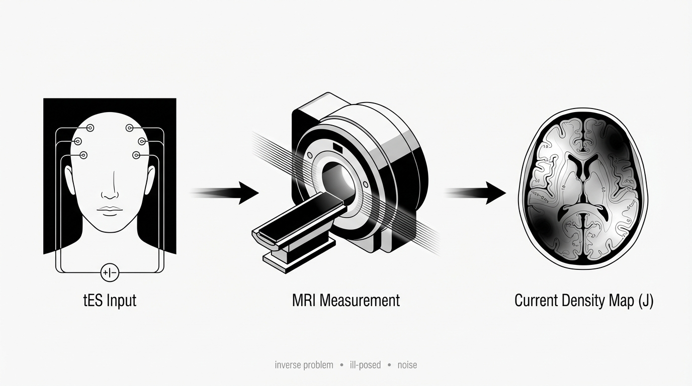
*   **Anahtar Kelimeler:** inverse problem, ill-posed, noise
*   **Konuşmacı Notu:** Projeyi tek cümleyle şöyle okuyorum: *tES sırasında MRI’dan aldığımız ölçümleri kullanarak, beyindeki akım yoğunluğu dağılımını (J) yüksek doğrulukta haritalamak.* Bu, doğası gereği bir **inverse problem**.

### Slide 68: Sorun - Neden Yapay Zekaya İhtiyacımız Var?
*   **Başlık:** Neden Zor? (Inverse Problem Reality Check)
*   **Görsel:** Solda “measurement” (bulanık/noisy), sağda “solution space” (çoklu olası çözümler bulutu).
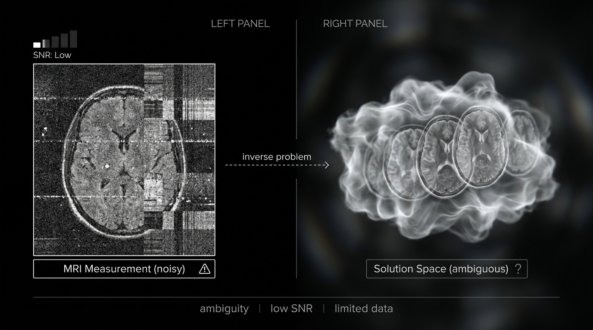
*   **Anahtar Kelimeler:** ambiguity, low SNR, limited data
*   **Konuşmacı Notu:** Bu tip projelerde zorluk genelde üç yerden geliyor: ölçüm gürültülü/eksik olabilir, problem ill‑posed olabilir (tek bir doğru yoktur), ve veri kıtlığı/kişiden kişiye değişkenlik genellemeyi zorlaştırır. Bu yüzden “sadece bir model” değil, doğru **prior + constraint** dengesi gerekiyor.

### Slide 69: Eğitimden Bildiğim Parça #1
*   **Başlık:** Regularization ↔ Prior (Stability)
*   **Görsel:** Yan yana iki “çözüm”:
    *   Solda: ölçüme “aşırı uyan” gürültülü harita
    *   Sağda: daha pürüzsüz/fiziksel olarak makul harita
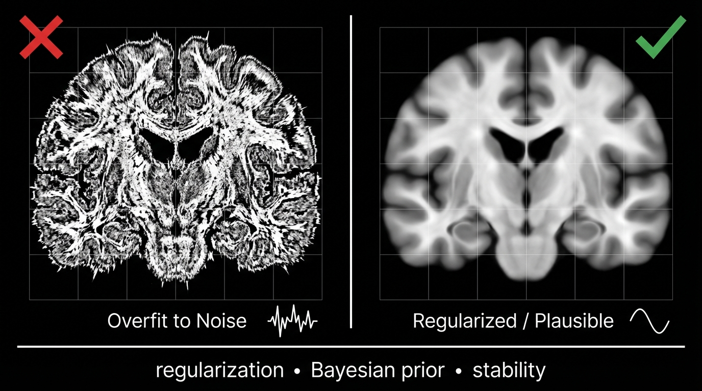
*   **Anahtar Kelimeler:** regularization, Bayesian view, stability
*   **Konuşmacı Notu:** Bölüm 1’de regularization’ı “ezberlemeyi engellemek” diye öğrendik. Burada aynı fikir, **inverse problem** stabilitesi için kritik: çözümün “ölçüme uyum” ve “makul öncül/prior” dengesini tutturmak gerekiyor.

### Slide 70: Eğitimden Bildiğim Parça #2
*   **Başlık:** Diffusion = Learned Denoising Prior
*   **Görsel:** Gürültü → (N adım) → temiz/struktur harita zinciri.
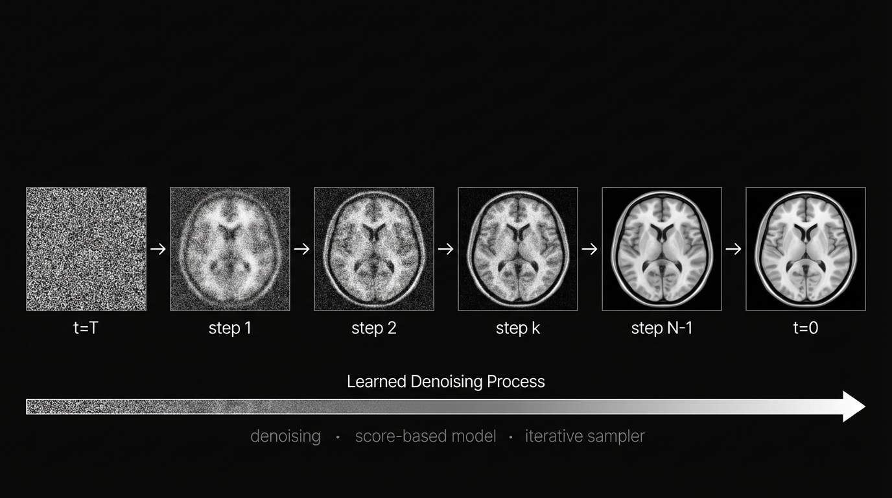
*   **Anahtar Kelimeler:** denoising, score-based, sampler
*   **Konuşmacı Notu:** Unit 1’de en temel içgörü şuydu: model “görüntü üretmeyi” değil, **gürültüyü tahmin edip temizlemeyi** öğreniyor. Bu, tıbbi görüntüleme ve benzeri inverse problemlerde diffusion’ı doğal bir **learned prior** yapıyor.

### Slide 71: Eğitimden Bildiğim Parça #3
*   **Başlık:** Conditioning = Data Consistency
*   **Görsel:** Ortada diffusion “denoise step”, sağda ölçüm “check/constraint” kutusu; her adımda küçük düzeltme oku.
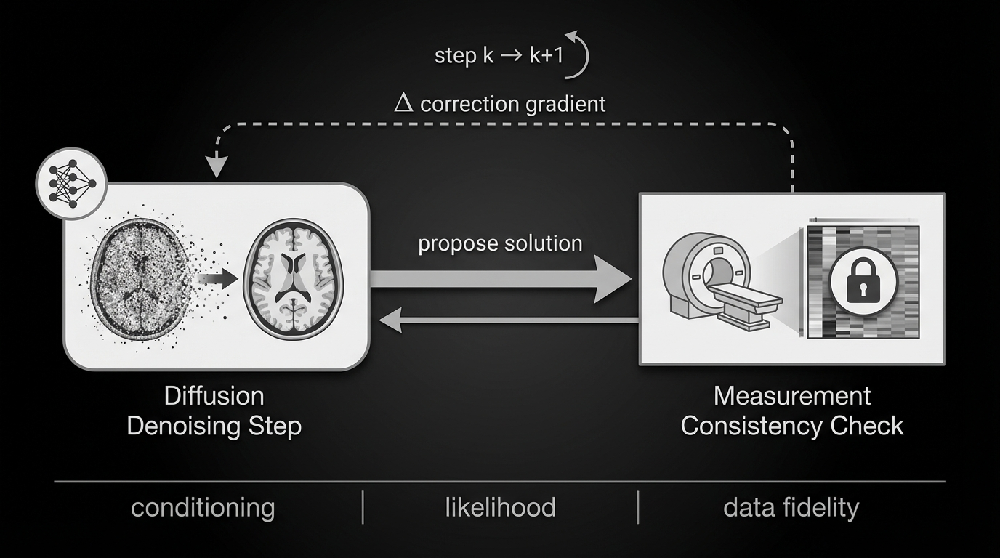
*   **Anahtar Kelimeler:** conditioning, likelihood, data fidelity
*   **Konuşmacı Notu:** Unit 2’de conditioning/guidance ile “modelin ne üretmesini istediğimizi” kontrol ediyorduk. Projede de benzer mantık var: modelin ürettiği harita, ölçümle **uyumlu** kalmalı. Bu, pratikte “data fidelity / likelihood” diye geçen kısım.

### Slide 72: Eğitimden Bildiğim Parça #4
*   **Başlık:** Guidance = Constraint Injection
*   **Görsel:** 3 yönlü pusula:
    1.  Measurement guidance
    2.  Anatomy guidance (structural MRI)
    3.  Physics guidance (Maxwell/PDE)
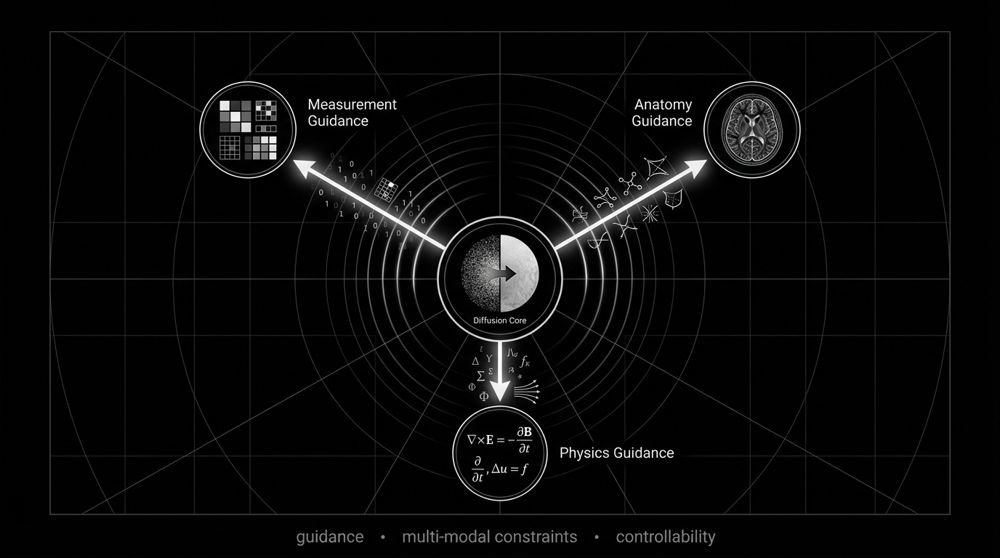
*   **Anahtar Kelimeler:** guidance, constraints, controllability
*   **Konuşmacı Notu:** Unit 2’de guidance “modelin kulağına fısıldamak”tı. Burada fısıltının kaynağı metin/renk olmak zorunda değil: ölçüm, anatomi veya fizik kısıtları da guidance olarak kurgulanabilir.

### Slide 73: Physics-Informed Angle (Neden Mantıklı?)
*   **Başlık:** “Güzel” Değil, “Fiziksel Olarak Tutarlı”
*   **Görsel:** İki küme kesişimi:
    *   Sol: Data-consistent solutions
    *   Sağ: Physics-consistent solutions
    *   Kesişim: Trustworthy solutions
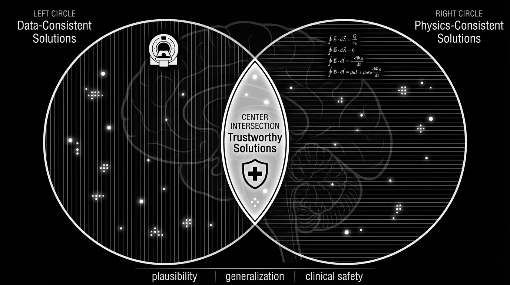
*   **Anahtar Kelimeler:** plausibility, generalization, safety
*   **Konuşmacı Notu:** Projenin klinik/biomedikal tarafında en kritik şeylerden biri “tutarlılık”. Modelin çıktısı ölçüme uyarken, aynı zamanda fiziksel olarak saçma olmamalı. Bu yüzden physics-informed yaklaşım “nice to have” değil; güvenilirlik için temel motivasyon.

### Slide 74: Uncertainty (Diffusion'ın Bonus Gücü)
*   **Başlık:** Tek Harita Değil, Dağılım (Posterior)
*   **Görsel:** Aynı beyin üzerinde 4 örnek çözüm + altta “agreement map” (ortak bölgeler koyu).
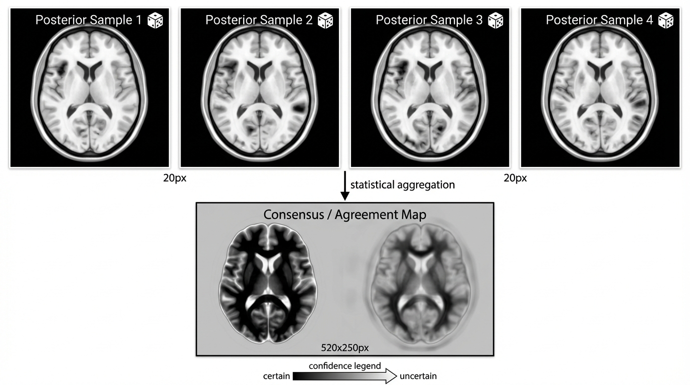
*   **Anahtar Kelimeler:** posterior sampling, uncertainty, confidence
*   **Konuşmacı Notu:** Deterministik modeller “tek cevap” verir. Diffusion ise doğal olarak örneklem üretebildiği için, aynı veriden birden fazla olası çözüm çıkarıp belirsizliği görünür kılabilir. Bu, bilimsel/klinik yorumlama için çok değerli.

### Slide 75: Sektörde / Literatürde Kullanım Örüntüleri
*   **Başlık:** Bu Yaklaşım Nerelerde Kullanılıyor?
*   **Görsel:** 3 kutu (aynı tasarım dili):
    1.  **Reconstruction** (undersampled/limited measurements)
    2.  **Denoising / Super-resolution**
    3.  **Inverse Problems & Posterior Sampling**
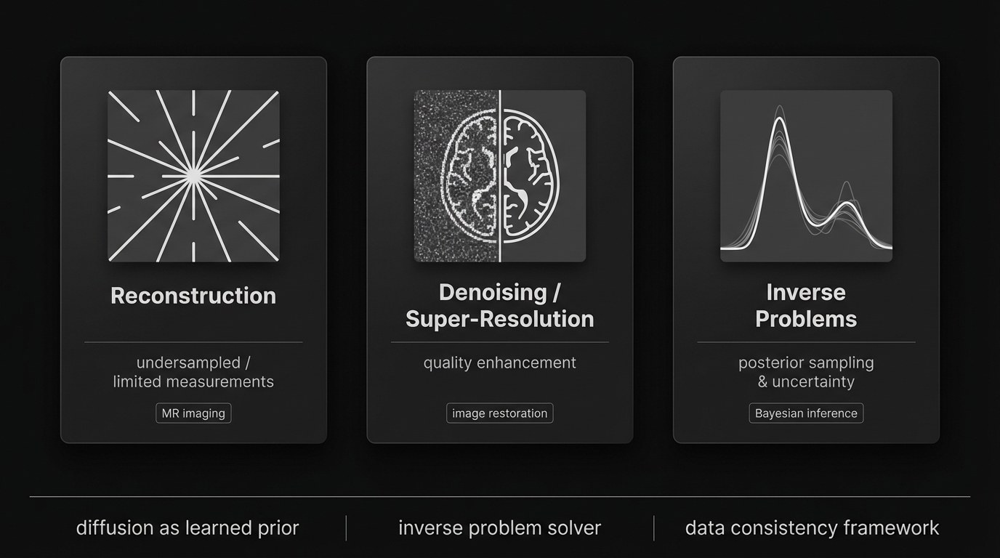
*   **Anahtar Kelimeler:** diffusion prior, inverse solver, data consistency
*   **Konuşmacı Notu:** MR rekonstrüksiyonundan denoising/super-resolution’a, oradan genel inverse problems’a kadar diffusion modeller “learned prior + constraint” kombinasyonu olarak kullanılıyor. Projemiz bu hattın çok doğal bir uzantısı.

### Slide 76: Kapanış - Teşekkürler
*   **Başlık:** Teşekkürler!
*   **Alt Başlık:** Sorularınızı Bekliyorum
*   **Görsel:** Şık, minimal bir kapanış tasarımı. Arka planda hafifçe beliren, diffusion modeliyle üretilmiş estetik bir beyin görüntüsü (soft blue-purple gradyan). Ortada büyük "Teşekkürler" metni.
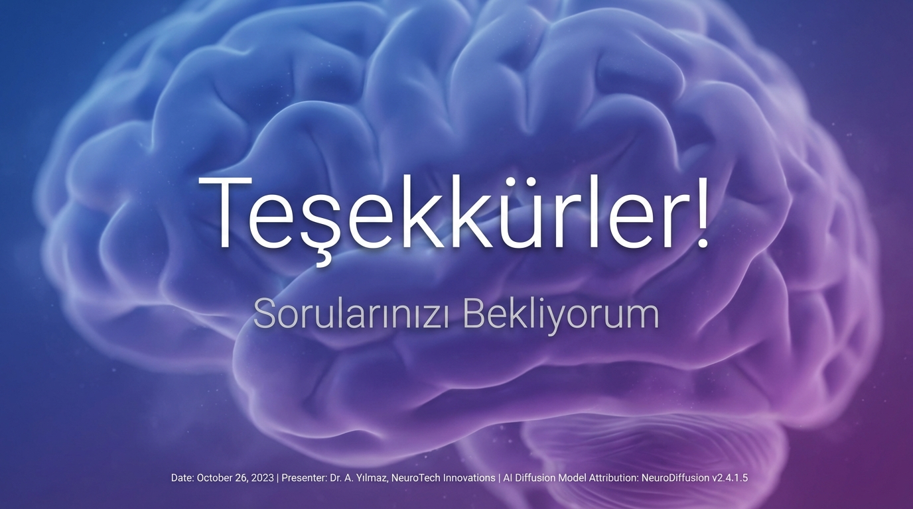
*   **Konuşmacı Notu:** Buraya kadar benimle geldiyseniz, artık hem diffusion model teorisini, hem PyTorch pratiğini, hem de bunların gerçek dünya uygulamalarını gördünüz. Yolculuğumuz burada sona eriyor, ama gerçek iş şimdi başlıyor. Projeye katkı yapmak, araştırmayı derinleştirmek ve belki de sizin de kendi projelerinizde bu teknikleri kullanmak için. Teşekkür ederim, sorularınızı almaktan mutluluk duyarım!
